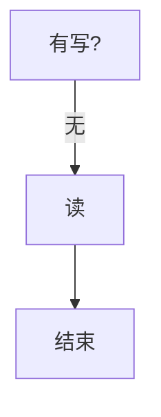
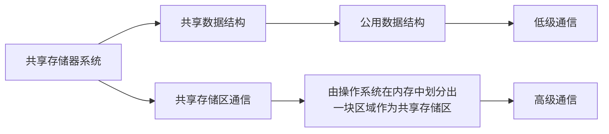
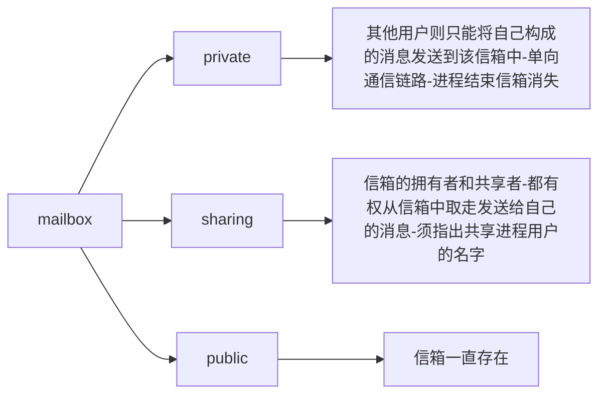
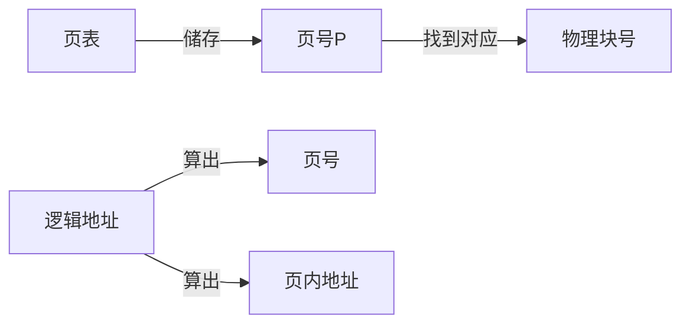

---
b

title: 计算机操作系统笔记
date:
tags: 学习笔记  
categories: 课程内
---

计算机操作系统笔记

<!--more-->

[TOC]


# 第一章 计算机操作系统概论

**操作系统定义**：操作系统是位于硬件层(HAL)之上，所有其它系统软件层之下的一个系统软件。其主要作用是管理好这些设备，提高它们的利用率和系统的吞吐量，并为用户和应用程序提供一个统一的接口，便于用户使用。

**OS**是计算机系统的灵魂！

## 操作系统的目标及作用

目标：有效 方便 可扩充 开放

作用：

1. 看做是用户与计算机硬件系统之间的接口。

用户命令和系统调用

2. OS作为计算机系统资源的管理者
3. OS实现了对计算机资源的抽象

## 发展

单批道：

系统对作业的处理都是成批进行的，且在**内存中**始终**仅存一道**作业运行，


主要缺陷：I/O操作执行时不可继续

**自动性、顺序性、单道性**

调度，无序，多道

多批道：

用户所提交的作业先放在外存形成队列

**在内存中存放多道作业运行**

当在操作A的I/O时调度B的程序运行，增加CPU利用率

|          | **A**    | **B**    | **C**    |
| -------- | -------- | -------- | -------- |
| **计算** | **30ms** | **60ms** | **20ms** |
| **I/O**  | **40ms** | **30ms** | **40ms** |
| **计算** | **10ms** | **10ms** | **20ms** |


**ATTENTION**：==B这里没有要求一个程序要一次性执行完==


**分时系统**

多路性：多终端分时共享，提高资源利用率，降低费用。
独立性：每个用户在各自的终端上进行操作，彼此之间互不干扰，感觉就像独占主机。
及时性：及时响应请求，通常为1-3秒。
交互性：指用户可通过终端与系统进行广泛的人机对话。


**实时系统**

实时、分时的比较
多路性：相同
独立性：相同
及时性：实时系统要求更高
交互性：分时系统交互性更强
可靠性：实时系统要求更高


▪ **实现分时系统的关键问题是什么？应如何解决？**


## 操作系统基本特性

### 并发 

并行 parallelism：多个事件同一时间

并发 concurrency：多个事件同一时间间隔

### 共享

是指系统中的资源可供内存中多个并发执行的进程共同使用。（**包含了同时，与图书馆的图书共享不同**）

1 互斥共享


2 同时访问方式

​	一段时间内，多个进程可以同时使用这个资源。

​	从**微观**上看，多个进程**交替**互斥地使用系统中的某个资源。例如磁盘。

### 虚拟

​	是指通过某种技术把一个物理实体变为（映射为）若干个逻辑上的对应物，用于实现虚拟的技术称为虚拟技术

### 异步

​	进程以人们不可预知的速度向前推进，执行结果不确定，程序不可再现


## 操作系统主要功能

也就是从资源管理的角度的作用

1、处理机管理（CPU）
2、存储器管理
3、设备管理
4、文件管理
5、方便用户使用的用户接口。 


## os的结构设计

▪**无结构**


▪**模块式**

▪**层次式**


**微内核**


# 第二章 进程的描述与控制

多批道处理，引进进程

## 2.1 前趋图和程序执行

前趋图(Precedence Graph)是一个有向**无循环**图

程序顺序执行时的特征：

（1）顺序性：处理机的操作严格按照程序所规定的顺序执行。
（2）封闭性：程序运行时独占全机资源，程序一旦开始执行，**其执行结果不受外界因素影响**。
（3）可再现性：只要程序执行时的环境和初始条件相同，都将获得**相同的结果**。
（不论它是从头到尾不停顿地执行，还是“停停走走”地执行）

程序的并发执行 ：==不存在前驱关系的程序==

（1）间断性
程序并发执行是，由于共享系统资源，这些程序形成相互制约的关系，当完成计算C~i-1~时如未完成I~i~，则不可继续C~i~

（2）失去封闭性 
程序并发执行时，多个程序共享系统资源，因而这些资源的状态将由多个程序来改变，从而导致程序的运行失去封闭性

（3）不可再现性 
	程序并发执行，由于失去了封闭性，从而也失去了可再现性


## 2.2进程的描述  

### process定义及特征

为使程序并发进行--引入进程概念

为使程序可独立运行--PCB（Process Control Block）

定义：

典型的进程定义有：
（1）进程是程序的一次执行。
（2）进程是一个程序及其数据在处理机上顺序执行时所发生的活动。
（3）进程是程序在一个数据集合上运行的过程，**它是系统进行资源分配和调度的一个独立单位。**

​																			  **优化则是以线程为调度单位**

结构特征

==**程序段+数据段+PCB=进程实体=进程**==（软件=代码+数据+文档）

==**创建进程实质是创建PCB**==


 1）动态性： 进程的实质是进程实体的一次执行过程，因此，动态性是进程的最基本的特征。
动态性表现：“**它由创建而产生，由调度而执行，由撤消而消亡**”。可见，进程实体有一定的生命期。
程序是一组有序指令的集合，其本身并不具有运动的含义，因而是静态的

  2）并发性
   这是指多个进程实体同存于**内存**中，且能在一段时间内同时运行。（多道批处理的时候是在外存）
  3）独立性
   指进程实体是一个能独立运行、独立分配资源和独立接受调度的基本单位；
  4）异步性
   指进程按各自独立的、不可预知的速度向前推进，或说进程实体按异步方式运行。


在传统的操作系统中，程序并不能独立地运行，作为资源分配和独立运行的基本单位是进程，操作系统的四大特征（并发性、共享性、虚拟技术、异步性）都是基于进程而形成的，我们可以从进程的观点来研究操作系统。

> 进程和程序和作业的异同


### 进程的基本状态

1）就绪（Ready）状态：当进程已分配到**除CPU以外**的所有必要资源后，只要再获得CPU，便可立即执行。
 2）执行状态：进程已获得CPU，其程序正在执行。
 3）阻塞状态：正在执行的进程由于发生某事件而暂时无法继续执行时，便放弃处理机而处于暂停状态，把这种暂停状态称为阻塞状态，有时也称为等待状态。根据阻塞原因，系统中设置多个阻塞队列。


执行态->就绪态：高优先级任务或超时


### 对进程的操作--挂起

进程挂起后处于静止状态

还有完成和创建

> 能从一种状态转化为另外3种的是执行


（上图经过旋转，层次更符合认知）

blockeds->readys

==ready不会直接到block==

是不可以直接到readya的

new->readya

new->readys主要是主存不分配空间,进程被安置在外存


## 2.3进程控制

### pcb

- 作用

**独立运行基本单位的标志。**
能实现间断性运行方式。（保护CPU现场）
提供进程管理所需要的信息。（OS通过PCB对进程实施控制和管理。）
提供进程调度所需要的信息。（提供进程状态、优先级等信息）
实现与其它进程的同步与通信。（消息队列指针，信号量等）

- 包含的内容

**进程标识符**

进程状态信息

​	sp  pc   psw   通用寄存器

进程控制信息

​	链接指针   程序和数据地址   进程同步信息  资源清单	

进程调度信息

​	进程状态  进程阻塞原因   进程其他信息   进程优先级

- 组织方式

链接方式


索引方式


操作系统内核：一些与硬件紧密相关的软件常驻内存

OS内核在系统态运行。

进程控制一般是由OS内核中的一组**原语**来实现的。 一个不可分割的基本单位，在执行过程中不允许被中断。


内核功能--> 资源管理功能

​                --> 支撑功能


引起 进程的创建的 事件


| 创建                             | 终止                                                         |
| -------------------------------- | ------------------------------------------------------------ |
| 申请空白PCB。                    | 根据被终止进程的PID找到它的PCB，从中读出该进程的状态         |
| 为新进程分配资源。               | 若被终止进程正处于执行状态，应立即终止该进程的执行，重新进行调度若该进程还有子孙进程，立即将其所有子孙进程终止 |
| 初始化进程控制块。               | 将被终止进程所拥有的全部资源，归还给其父进程，或者归还给系统 |
| 将新进程插入就绪队列，启动调度。 | 将被终止进程的PCB从所在队列中移出                            |

①初始化标识信息。
②初始化处理机状态信息。使程序计数器指向程序的入口地址，使栈指针指向栈顶；
③初始化处理机控制信息：进程的状态、优先级。


| 阻塞                                                         | 唤醒                                                         |
| ------------------------------------------------------------ | ------------------------------------------------------------ |
| 把进程控制块中的现行状态由“执行”改为阻塞，并将PCB插入阻塞队列 | 首先把被阻塞的进程从等待该事件的阻塞队列中移出 将其PCB中的现行状态由阻塞改为就绪 |
| 转调度程序进行重新调度，将处理机分配给另一就绪进程，并进行切换 | PCB插入到就绪队列                                            |

**注意**:进程不能自己唤醒自己


| 挂起                                                         | 激活                                                         |
| ------------------------------------------------------------ | ------------------------------------------------------------ |
| 首先检查被挂起进程的状态，若处于活动就绪状态，便将其改为**静止就绪**；对于活动阻塞状态的进程，则将之改为**静止阻塞**； | 激活原语检查该进程的现行状态，若是静止就绪，便将之改为**活动就绪**；		若为静止阻塞，便将之改为**活动阻塞** |
| 被挂起进程的PCB复制到指定的内存区域。                        | 从外存调入内存                                               |

创建、终止（自己）、挂起（自己）、激活、阻塞、唤醒都可能会产生新的调度


挂起和唤醒都不是自身发起


## 2.4进程同步

纯软件方法虽然可以解决进程互斥进入临界区问题，存在以下问题：
**软件方法始终不能解决“忙等”现象，降低系统效率。**
采用软件方法实现进程互斥使用临界资源是很困难的，它们通常能实现**两个进程**的互斥，很难控制多个进程的互斥。
算法设计需要非常小心，否则可能出现死锁，或互斥失败等严重问题。

**与软件解决方法比较，硬件这种方法减少了系统额外开销**

**软件方法和硬件方法都存在“忙等”问题，浪费了处理机时间。**


如果有多个进程需要同时修改某一数据，系统必须控制，一次仅允许一个进程完成读数据、修改数据两件事以后，才允许别的进程对同一数据的读和修改操作。 

信号量按照功能来分：互斥信号量和资源信号量。
**互斥信号量**：用于申请或释放资源的使用权，常初始化为1。
**资源信号量**：用于申请或归还资源，可以初始化为大于1的正整数，表示系统中某类资源的可用个数。


使程序的执行具有可再现性。

**任何时刻，只允许一个进程进入临界区，以此实现进程对临界资源的互斥访问。**

临界区使用原则

- 空闲让进
- 忙则等待
- 有限等待：进程只能在临界区内停留有限时间
- 让权等待（自己不进让别人进）（忙等）

```
while(true){

	进入区  
	临界区  
	退出区  
	剩余区  

}
```


*软件方法始终不能解决“忙等”现象，降低系统效率*

*硬件不能实现让权等待*

硬件也不能解决忙等

信号量功能分类

- 互斥 初始化为1
- 资源 初始化>1

信号量机制分类

- 整型   会出现忙等
- 记录型
- AND型
- 信号量集


## 2.5经典进程的同步问题

> 同步和互斥[https://blog.csdn.net/qq_41727218/article/details/88376773?ops_request_misc=%257B%2522request%255Fid%2522%253A%2522161901628416780262528485%2522%252C%2522scm%2522%253A%252220140713.130102334..%2522%257D&request_id=161901628416780262528485&biz_id=0&utm_medium=distribute.pc_search_result.none-task-blog-2~all~sobaiduend~default-1-88376773.first_rank_v2_pc_rank_v29&utm_term=%E4%BA%92%E6%96%A5%E5%92%8C%E5%90%8C%E6%AD%A5]


>  生产者和消费者问题
>
>  该问题的关键就是要保证生产者不会在缓冲区满时加入数据，消费者也不会在缓冲区中空时消耗数据。所以要full和empty


**如何里实现没有空沙发时离开？**

==wait只能阻塞不能离开==

如果设置资源信号量表示沙发，**在wait资源信号量时必然陷入阻塞，无法离开。**
解决办法是用变量表示沙发数，用一个互斥量保护变量，这样既可通过条件判断避免阻塞。
int count=n，semaphore mutex=1
Wait(mutex)
If( count >= N){
	signal(mutex)
	离开理发店
}else{
	count++
	signal(mutex)
     ……


- 读者/写者

>  reader如何在读人数需要被保护吗


然后读之前对write加锁,读完对write解锁不就行了么

> 我的问题:为什么要保护readcount
>
> 因为readcount是临界资源
>
> 所以wait（wmutex）是只针对 readcount=0 的情况而以


## 2.6进程通信

低级通信：进程之间**的互斥**和同步，由于其所交换的**信息量少**而被归结为低级通信。交换控制信息

高级通信：是指用户可直接利用操作系统所提供的一组通信命令高效地传送**大量数据**的一种通信方式。

1    生产者消费者是共享数据结构



2**管道通信**：

向管道(共享文件)提供输入的发送进程(即**写进程**)， 以**字符流**形式将大量的数据送入管道；(无结构文件)
而接受管道输出的接收进程(即**读进程**)，则从管道中接收(读)数据。由于发送进程和接收进程是利用管道进行通信的，故又称为管道通信。**以字符流形式**

① 互斥，即当一个进程正在对pipe执行读/写操作时，其它(另一)进程必须等待。 
② 同步，指当写(输入)进程把一定数量(如4 KB)的数据写入pipe，便去睡眠等待， 直到读(输出)进程取走数据后，再把他唤醒。当读进程读一空pipe时，也应睡眠等待，直至写进程将数据写入管道后，才将之唤醒。
③ 确定对方是否存在，只有确定了对方已存在时，才能进行通信。 

3**消息传递方式系统**：**是高级**

直接：

发送进程利用OS所提供的发送命令，直接把消息发送给目标进程

间接：

需要通过某种中间实体如信箱

sharing：操作系统创建

public：进程创建



4**客户机—服务器系统**—网络通信，套接字、RPC


## 2.7线程的基本概念

以提高程序并发执行的程度，进一步提高系统的吞吐量。

|              | Process                      | Thread                                   |
| ------------ | ---------------------------- | ---------------------------------------- |
| schedule     | 进程作为资源拥有的基本单位。 | 线程作为调度和分派的基本单位             |
| concurrent   | Y   都可以并发执行           | Y                                        |
| resource     |                              | 本身并无系统资源，多个线程共享该进程资源 |
| independence |                              | less                                     |


### TCB

(1)用于控制和管理线程
(2)线程控制块的内容：
线程标志符
一组寄存器
线程运行状态 
用户栈 

优先级
专有存储区
信号屏蔽

## 2.8线程的实现


kst

▪**在内核空间为每一个内核线程设置了一个线程控制块，内核是根据该控制块而感知某线程的存在的，并对其加以控制。**

ult

**无须利用系统调用**

## 信号量和互斥锁-任务的同步和互斥

https://www.jianshu.com/p/c6ba8bcc22bc


mutex and binary semaphore

https://stackoverflow.com/questions/62814/difference-between-binary-semaphore-and-mutex?r=SearchResults


# 第三章 处理及调度与死锁

## 3.1  处理机调度的基本概念 

1. 高级调度(High Scheduling) 
   外存上处于后备队列中的那些作业调入内存，也就是说，它的调度对象是**作业**
   
2. 中级调度
   
   
   
   内存调度,提高吞吐量和内存利用率,把暂时不运行的程序放置**外存**   
   
3. 低级调度(Low level scheduling)
   它所调度的对象是进程(或内核级线程)。

 - 进程调度的实质 处理器资源合理分配给适当的进程

 - 进程调度就是从就绪状态的进程中，挑选一个进程到处理器上运行

   https://blog.csdn.net/qq_19018277/article/details/98491539?ops_request_misc=%257B%2522request%255Fid%2522%253A%2522161905601216780269893259%2522%252C%2522scm%2522%253A%252220140713.130102334..%2522%257D&request_id=161905601216780269893259&biz_id=0&utm_medium=distribute.pc_search_result.none-task-blog-2~all~sobaiduend~default-1-98491539.first_rank_v2_pc_rank_v29&utm_term=%E4%B8%AD%E7%BA%A7%E8%B0%83%E5%BA%A6


### 进程调度

- 非抢占方式(Non-preemptive Mode)

决不会因为时钟中断等原因而抢占正在运行进程的处理机，也不允许其它进程抢占已经分配给它的处理机。

可能引起进程调度的因素

   1 正在执行的进程执行完毕， 或因发生某事件而不能再继续执行；
   2 执行中的进程因提出I/O请求而暂停执行；
   3 在进程通信或同步过程中执行了某种原语操作，如P操作(wait操作)、Block原语、suspend原语等。

- 抢占方式(Preemptive Mode) 

根据某种原则去暂停某个正在执行的进程，将已分配给该进程的处理机重新分配给另一进程。

（小小吐槽，杨老师的ppt的categories一点都不好）

### 处理机调度算法的目标

**调度的原则：满足用户的需要和系统的需要。**

1、提高资源利用率
	CPU利用率= $\frac {CPU有效工作时间} {(CPU有效工作时间+CPU空闲等待时间)}$

2、公平性
3、系统资源使用的平衡性
4、策略强制执行


- 没有调转时间

- 作业 Job：用户提交给系统的一项相对独立的工作。==程序+数据+作业说明书==

带权周转=周转/服务时间


批处理系统目标：

- 平均周转时间短

- 系统吞吐量高：尽量多地选择短作业运行

- 处理机利用率高：尽量选择计算量大的作业

分时处理系统目标-

- 响应时间快：分时系统的重要准则。
- 均衡性：指系统响应时间的长短应与用户所 请求服务的复杂性相适应。

实时系统目标：

- 截至时间保证
- 可预测性（暂时不是很明白）**保证任务执行的连续性，执行流程能够事先确定**

## 3.2  调度算法 

==作业和进程和线程的区别==

一个作业通常包括程序、数据和操作说明书3部分。每一个进程由PCB、程序和数据集合组成。这说明程序是进程的一部分，是进程的实体。因此，一个作业可划分为若干个进程来完成，而每一个进程有其实体————程序和数据集合

1. 先来先服务（FCFS）
   对待**短作业**（进程）不公平，如果他们排在队列后面，则其等待时间远大于其执行时间

2. 短进程优先（SJPF）

  - 该算法对**长作业**不利

  - 不能保证紧迫性作业(进程)会被及时处理。

- 由于作业(进程)的长短只是根据用户所提供的估计执行时间而定的，而用户不一定对执行时间估计那么准确，致使该算法不一定能真正做到短作业优先调度。

  

3. 时间片轮转调度算法（round robin RR）：

   基本单位是system tick

   **重点是队列的顺序**

   排成一个队列，每次调度时，把CPU分配给队首进程。并令其执行一个时间片
   内核在满足下列条件时，将把CPU交给下一个就绪态的进程：
   当前进程因为某种原因暂停执行，如被阻塞；
   当前进程在时间片还没有结束时已经完成了；
   时间片结束。

- 优点：对分时系统有利
- 缺点：太小增加系统开销太大退化为FCFS，**对I/O系统不利**因为在两次I/O之间仅需很少的CPU时间，却需要等待一个时间片。（不是很明白）


4. 高优先权优先调度算法（priority-scheduling algorithm PSA）

   处理机分配给就绪队列中优先级最高的进程。

   - 非抢占式

     该进程便一直执行下去，直至完成

   - 抢占式

     只要又出现了另一个其优先权更高的进程，进程调度程序就立即停止当前进程的执行，重新将处理机分配给新到的优先权最高的进程。

     * 优点：能更好地满足紧迫作业的要求，故而常用于要求比较严格的实时系统中，以及对性能要求较高的批处理和分时系统中
     * 缺点：系统开销较大

5. 高响应比优先调度算法（Highest Response Ration Next HRRN ）

   优先权=$\frac{等待时间+要求服务时间}{要求服务时间}$=$\frac{响应时间}{要求服务时间}$

   

   该算法既照顾了短作业，又考虑了作业到达的先后次序，不会使长作业长期得不到服务。
   利用该算法时，每次调度之前，都须先做响应比的计算，会增加系统开销。

6. 实时调度算法

7. 最早截至时间优先EDF算法


## 3.3  实时调度 

## 3.4  多处理机系统中的调度 

## 3.5  产生死锁的原因和必要条件 


解决方法：

预防     是通过设置某些限制条件，去破坏产生死锁的四个必要条件中的一个或几个条件，来预防发生死锁

避免    是在资源的动态分配过程中，用某种方法去防止系统进入不安全状态，从而避免发生死锁。

检测

解除


## 3.6  预防死锁的方法 


▪**安全状态没有死锁的状态，非安全状态可能有死锁的状态**


==银行家算法：避免==

银行家算法：预先检测


## 3.7  死锁的检测与解除 

# 第四章 存储器管理

## 4.1 存储器的层次结构


寄存器、高速缓存、主存储器和磁盘缓存均属于操作系统存储管理的管辖范畴，掉电后它们存储的信息不再存在。

**固定磁盘**和可移动存储介质属于设备管理的管辖范畴，它们存储的信息将被长期保存。

长期保存则文件选择磁盘

## 4.2 程序的装入和链接 
源程序变成一个可在内存中执行的程序，通常要经过3步骤


### **程序的装入** 

- (1)．绝对装入方式 

  知道程序将驻留在内存的什么位置,**逻辑地址与实际内存地址完全相同**

- (2)．可重定位装入方式  

  把在装入时对目标程序中指令和数据的变换过程称为重定位。

​       地址变换是在装入时一次完成的，**以后不再改变**，故称为静态重定位

- (3)．动态运行时装入方式

  并不立即把装入模块中的相对地址转换为绝对地址，而是把这种地址转换推迟到**程序执行时进行**
  
### 程序的链接

根据链接时间的不同分类

- 静态链接方式

  

  在**程序运行之前**链接模块 且 不再改变

  - 在链接成一个装入模块时修改模块的相对地址。
  - 将每个模块中所用的外部调用符号也都变换为相对地址。例如将call B 变换为JSR “L”

- 装入时动态链接

  在装入内存时，采用**边装入边链接**的链接方式。即分别装入各模块，并且在装入的过程中修改相对地址和外部引用地址。

  

- 运行时动态链接

  **运行时**发现引用的地址是相对地址或者外部地址时，才发起链接，寻找正确的引用地址

## 4.3  连续分配存储管理方式 

为使程序装入内存

### 单一连续分配

单道程序环境下: **分系统区和用户区**

整个内存的**用户区**只驻留一个用户的一个程序

### 固定分区分配（内零头）

叫内零头是因为未被使用内存仍在内存中

分区划分方法:
大小等
大小不等

内存分配情况用分区描述表记录


### 动态分区分配（外零头）

**分区的数据结构**

- 空闲分区表
- 空闲分区链

**分区分配操作**


	请求的分区大小为u.size，
	表中每个空闲分区的大小可表示为m.size。
	size是事先规定的不再切割的剩余分区的大小，m.size-u.size≤size，说明多余部分太小，不再分割，否则，从该分区中划分一部分空间给请求者。
**分区回收 **


### **4.3.4** **顺序搜索的动态分区分配算法**


首次匹配(首次适应算法FF )：
要求空闲分区链以**地址递增**的次序链接

循环匹配(循环首次适应算法NF) :
查找不是从头开始，而是从上次找到的空闲分区的下一个空闲分区开始查找

最佳匹配(最佳适应算法BF ):
空闲分区按其容量以从小到大的顺序

最坏适应算法 WF:
从大到小的顺序


### 4.3.5 基于索引搜索的动态分区分配算法

1. 快速适应算法
将空闲分区根据其容量大小进行分类，对于每一类具有相同容量的所有空闲分区，单独设立一个空闲分区链表。

2. 伙伴系统    不需要紧凑的动态分区算法。

   

缺点：内存利用率不高，分配的内存大小为2的幂，假如只需要65个页面，也需要分配128个页面的块，从而浪费了63个页面，即产生内部碎片。

### 4.3.6 可重定位分区分配

**紧凑技术**


(再看看ppt)即须在系统中增设一个重定位寄存器，用它来存放程序(数据)在内存中的起始地址


## 4.4  对换


## 4.5  分页存储管理方式 


程序在内存中不一定连续存放

根据离散时的**基本单位**不同，可分为三种：

-  分页存储管理 

-  分段存储管理 

-  段页式存储管理

  ###  分页存储管理 
  
  #### 4.5.1分页存储管理的基本方法

1.  页面和物理块

- 页面

把每个进程的逻辑地址空间分成一些**大小相等**的片


- 页面大小

页面大小应是2的幂，通常为512B～8KB。

2. 地址结构

在页式管理系统中将程序地址空间分成**大小相同**(和上面一个意思)页面。将内存空间分成与页面相同大小的存储块。
32位机的分页存储逻辑地址结构:


若给定一个逻辑地址空间中的地址为A，页面的大小为L，则页号P和页内地址d可按下式求得：


其系统的页面大小为1 KB，设A = 2170 B，则由上式可以求得P = 2，d = 122。


3. 页表

系统应能保证进程的正确运行，==即能在内存中找到每个页面所对应的物理块==。为此，系统又为每个进程建立了一张页面映像表，简称页表。

**页表储存的就是物理块号**,与上面的页内地址不是一个东西(这个图画的海星:happy:)




#### **4.5.2** 地址变换机构

页表寄存器PTR，在其中存放当前运行的进程的页表在内存中的**起始地址**和**页表长度**。

当进程真正投入运行时，**从进程PCB中读出**页表的始址和页表长度并装入PTR


> 8K是这么用的


#### **具有快表的地址变换机构**


#### 二级页表 三次访问内存

> 这个大小对应关系好像不是很清楚
>
> 1m个页我了解
>
> 1M个页表项，若按字节寻址，一个页表项占4B，则一级页表 需要占用4MB（222）内存空间。不可能将4MB的 页表保存在一个连续区中


这里的b还是b*页面大小


## 4.6 分段存储管理方式 

4.6.1.引入分段的原因

个人理解完全是人为方便

- 方便编程
- 信息共享
- 信息保护
- 动态增长（这俩不知道是干啥的）
- 动态链接


### **4.6.2** **分段存储基本原理**

**为每个分段分配一个连续的分区，而进程中的各个段可以离散地移入内存中不同的分区中**

==每一个段都是连续的==

每个段有自己的名字和长度（程序段，代码段）。程序的逻辑地址是由段名（段号）和段内偏移量决定。每个段的逻辑地址从0开始编址.


当创建进程，将进程的程序和数据装入内存时，系统为之建立段表，并将段表的起始地址填入进程的PCB中。
当进程被调度执行时，取出其PCB中的段表首址，填入段表寄存器中。 


> 就是内零头和外零头的区别

内部碎片和外部碎片

内部碎片就是已经被分配出去（能明确指出属于哪个进程）却不能被利用的内存空间；

外部碎片指的是还没有被分配出去（不属于任何进程），但由于太小了无法分配给申请内存空间的新进程的内存空闲区域。

*分页分段的区别*

- 分页有内部碎片无外部碎片 页的空间未完全使用   
- 分段有外部碎片无内部碎片 用紧凑技术
- 分页的作业地址空间是一维的
- 而分段的作业地址空间则是二维的  **段名+段内地址。** 

### **4.6.4** **段页式存储管理方式**

**采用分段方法组织用户程序，采用分页方法分配和管理内存**

第一次访问是访问内存中的**段表**，从中取得页表始址；
第二次访问是访问内存中的**页表**，从中取出该页所在的物理块号，并将该块号与页内地址一起形成指令或数据的物理地址；
第三次访问才是真正从第二次访问所得的**地址**中，取出指令或数据。


慢!!!!!!!!!!!!!!!       可以设置快表


# 第五章 虚拟存储器

5.1 虚拟存储器概述

原因：内存不够

### **局部性原理**

**在一个较短的时间段内，程序的执行仅限于某个部分**

*所以哪个部分在内存内就很重要了*，局部性好就是这个意思

只要保证进程执行所需的部分程序和数据驻留在内存，一段时间内进程都能顺利执行。

后面clock算法的哪些内存被置换出的原理

- 时间局限性

如果程序中的某条指令一旦执行， 则不久以后该指令可能再次执行；如果某数据被访问过， 则不久以后该数据可能再次被访问。
产生时间局限性的典型原因，是由于在程序中存在着大量的循环操作。

- 空间局限性

旦程序访问了某个存储单元，在不久之后，其附近的存储单元也将被访问;程序在一段时间内所访问的地址，可能集中在一定的范围之内.


- 虚拟存储器:

**是指具有请求调入功能和置换功能，能从逻辑上对内存容量加以扩充的一种存储器系统，其逻辑容量由内存容量和外存容量之和所决定，其运行速度接近于内存速度，而成本却又接近于外存。** 

1．多次性
    多次性是指一个作业被分成多次调入内存运行。 
2．对换性
    对换性是指作业的运行过程中进行换进、换出，换进和换出能有效地提高内存利用率。 
3．虚拟性
  虚拟性是指能够从逻辑上扩充内存容量，使用户所看到的内存容量远大于实际内存容量。

*注意，虚拟储存和虚拟机是两码事*

为了能实现请求调页和置换功能，系统必须提供必要的硬件支持和相应的软件


实现方式有俩:


## 5.2 请求分页存储管理方式

**置换时以页面为单位**

### 基本原理

需要：

- 页表机制
- 缺页中断机构
- 地址变换机构
- （下面这几项完全是因为好看才分级别的）

#### 页表机制

与第四章的页表不同


状态位：也称存在位，标志该页是否驻留内存。
访问位：记录一段时间内该页被访问的情况，如一段时间内该页被访问的次数或者多长时间未被访问。
修改位：标记该页是否被修改过。注：为减少置换开销，**通常选择未被修改过的页面置换**。
外存地址：用于记录该页在外存上的存储地址。

(1)状态位(存在位)D：用于说明该页是否已调入内存，
供程序访问时参考；
D=0，该页不在内存
D=1，该页在内存
(2)访问位A：用于记录本页在一段时间内被访问的次
数，或最近已有多长时间未被访问，提供给置换算法
选择换出页面时参考。
A=0，该页未被访问 A=1，该页被访问
(3)修改位M：用于表示该页在调入内存后是否被修改
过，也是提供给置换算法在换出页面时是否将该页面
写回外存作参考。
M=0，该页在内存中未被修改
M=1，该页在内存中已经被修改
(4)外存地址：用于指出该页在外存上的地址，供调
入该页时使用。

#### **缺页中断机构**

每当所要访问的页面不在内存时，便产生一缺页中断，请求OS将所缺之页调入内存


#### 地址变换机制


### **5.2.2**  **请求分页中的内存分配**

最小物理块数，是指能保证进程正常运行所需的最小物理块数

物理块的分配策略

- **固定分配局部置换 ** 为每个进程分配一定数目的物理块，在整个运行期间都不再改变

- **可变分配全局置换**  

  

  最后的这个该进程指的是被置换出内存的进程

- **可变分配局部置换**

  为每个进程分配一定数目的物理块，但当某进程发现缺页
时，**只允许从该进程在内存的页面中选出一页换出**，这样
  就不会影响其它进程的运行。
  
  
  
  

###  **5.2.3** **页面调入策略**

1. 系统应当在何时把一个页面装入内存？

   预调页 (Prepaging)

   请求调页 (Demand Paging)

2. 从何处调入页面？

   **用于存放文件的文件区**    物理空间离散

   **用于存放对换页面的对换区。**       物理空间连续

3. 页面调入过程？

   系统缺少足够的对换区空间，*这时凡是不会被修改的文件，都直接从文件区调入*；

   

   **这里的透明是指对用户不可见**

   

## 5.3 页面置换算法

### 1）.最佳(优)置换算法


### 2）.先进先出（FIFO）页面置换算法

**淘汰最先进入内存的页面**

### 3）. 最近最久未使用（LRU）置换算法


所以第六个最小

### 4）. Clock置换算法

简单的Clock置换算法 
 当采用简单c1ock算法时，为每页设置一位访问位，再将内存中的所有页面都通过链接指针链接成一个循环队列。
当某页被访问时，其访问位被置1。
置换程序从上次停止位置开始检查页面的访问位。
如果是0，就选择该页换出；
若为1，则重新将它置0，暂不换出，而给该页第二次驻留内存的机会。
由于该算法是循环地检查各页面的使用情况，故称为c1ock算法。置换时是将未使用过的页面换出去，故又把该算法称为最近未用算法NRU。


### 5）改进型Clock置换算法

1类（A=0，M=0：表示该页最近既未彼访问，
又未被修改，是最佳淘汰页。
2类（A=0，M=1）：表示该页最近未被访问，
但已被修改，并不是很好的淘汰页。
3类（A=1，M=0）：最近已被访问，但未被修
改：该页有可能再被访问。
4类（A=1，M=1）：最近已被访问且被修改，
该页可能再被访问。

（1）从指针所指示的当前位置开始，扫描循环队列，
寻找A=0且M=0的第一类页面，将所遇到的第一个页
面作为所选中的淘汰页。在第一次扫描期间不改变访问
位A。
（2）如果第一步失败，即查找一周后未遇到第一类页
面，则开始第二轮扫描，寻找A=0且M＝1的第二类页
面，将所遇到的第一个这类页面作为淘汰页。在第二轮
扫描期间，将所有扫描过的页面的访问位A都置0。
（3）如果第二步也失败，亦即未找到第二类页面，则
将指针返回到开始的位置，并将所有的访问位复0。然
后重复第一步，如果仍失败，必要时再重复第二步，此
时就一定能找到被淘汰的页 

## 5.4“抖动”与工作集

如果系统花费大量的时间把程序和数据频繁地装入和移出内存而不是执行用户指令，那么，称系统出现了“抖动”。出现抖动现象时，系统显得非常繁忙，但是吞吐量很低，甚至产出为零。

工作集定义为：在*时间间隔* 里，进程实际所要访问页面的集合。

## 5.5 请求分段存储管理方式


# 第六章


来不及了直接在ppt上看


当用户因删除文件而释放存储空间时，系统将回 收的盘块依次插入空闲盘块链的末尾。


> 几个概念
>
> 页表--页框--物理块--页表项
>
> 页面大小 页表大小 页表项大小 存储空间大小
>
> 索引块数 物理块数
>
> 页面和页表项的关系


一个虚拟存储器的地址空间大小=辅助存储+内存