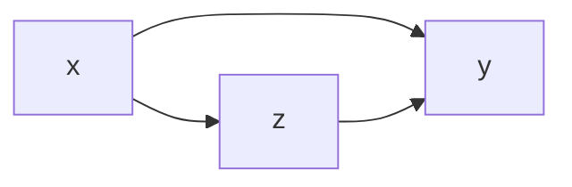
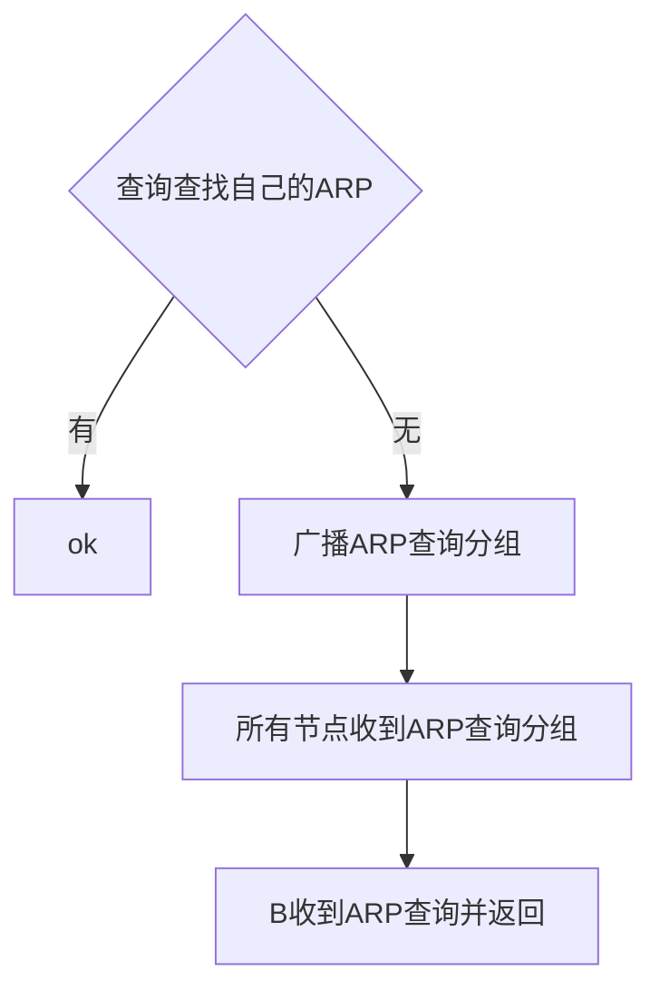

title: 计算机网络笔记
date:
tags: 学习笔记  
categories: 课程内

计算机操作系统网络笔记     

<!--more-->

文章部分的中英文标点符号有点混乱

使用New Sprint主题可以更明显看到加粗的中文字

现目前的理解，计算机通信和生活中的通信很像,一定不能从上帝视角看

王道考研视频是自底向上的,书是自顶向下的

怎么学.....建议就是看ppt然后看到关键词就上网上搜索,有个大概了解了再看ppt和书吧

其实说起来想从0开始学的话,一周简直绰绰有余啊.....之前为什么我没有这么整呢,真是疑惑

0524: 思科网的题让我煎熬；；根本什么都不会嘛

有些自己理解的部分按照这个来

[TOC]


# 第一章 计算机网络和因特网


## 计算机网络

两台以上具有独立操作系统的计算机通过某些介质连接成的相互共享软硬件资源的集合体。

计算机网络向用户提供的最重要的两大功能:

连通性

共享

Internet: “由网络构成的网络”

协议的基本要素：**语法、语义和同步**


第一个阶段还不是RFC文档


## **1.3.1** **网络核心部分**

电路交换: 每次会话预留沿其路径（线路）所需的独占资源－－电话 重点在于1/n
分组交换: 数据以离散的数据块通过网络来发送

- 每个端到端的数据流被划分成分组

  所有分组共享网络资源

  每个分组使用全部链路带宽

  资源按需使用


==虚电路一定是面向连接的==


## 1.5**分组交换网络中的延迟、丢失和吞吐量**

###      吞吐量

- 速率    数据传输的速率
- 带宽   发送数据的最高速率
- 吞吐量


### 时延


*注意传播时延的分母*

*传输时延是指将所有信号发出的时间,传播则是在路上的时间*

排对时延：拥塞程度


8Mbps=8Mb/s=1MB/s    注意B和b Byte = 8bit


什么是统计复用

> 统计复用(Statistic Multiplex)，也称为异步时分复

直通转发和存储转发


*rtt不包括传输时延*

##### 


PCI+SDU = PDU


- 应用层：所有能和用户产生网络流量的程序
- 表示层 处理两个通信系统中交换信息的表示方式（语法和语义）
    - 数据格式变化
    - 数据的解密和加密
    - 数据的压缩和恢复
- 会话层：向表示层实体用户进程提供**建立连接**，并有序的传输数据，建立同步 

> 如何理解这里的传输数据和传输层的功能区别

传输层：负责主机中两个进程的通信，**端到端通信**，单位是报文段或用户数据报


复用，多个进程可同时使用运输层的服务

分用，运输层把接受的消息分别交付给应用层中对应的进程

- 网络层 

把分组从源端传到目的端，为分组交换的网络上不同主机提供通信服务，基本单位是数据报

    数据报可被分成几个分组


   主机实现5层功能，路由器和交换机实现2-3层功能。

> PDU 协议数据单元   https://blog.csdn.net/haocrossover/article/details/69666867


> 协议和服务
>
> 1、协议的实现保证了能够向上一层提供服务。本层的服务用户只能看见服务而无法看见下面的协议。下面的协议对上面的服务用户是透明的。
> 2、协议是“水平的”，即协议是控制两个对等实体进行通信的规则。但服务是“垂直的”，即服务是由下层通过层间接口向上层提供的。上层使用所提供的服务必须与下层交换一些命令，这些命令在OSI中称为服务原语。


> https://www.cnblogs.com/lbhym/p/11713089.html#:~:text=%E9%80%9A%E5%B8%B8%E5%90%84%E5%B1%82%E6%89%80%E8%A6%81%E5%AE%8C%E6%88%90%E7%9A%84%E5%8A%9F%E8%83%BD%E4%B8%BB%E8%A6%81%E6%9C%89%E4%BB%A5%E4%B8%8B%E4%B8%80%E4%BA%9B%EF%BC%9A%201%EF%BC%89%20%E5%B7%AE%E9%94%99%E6%8E%A7%E5%88%B6,%EF%BC%8C%E4%BD%BF%E7%9B%B8%E5%AF%B9%E5%BA%94%E5%B1%82%E6%AC%A1%E5%AF%B9%E7%AD%89%E6%96%B9%E7%9A%84%E9%80%9A%E4%BF%A1%E6%9B%B4%E5%8A%A0%E5%8F%AF%E9%9D%A0%E3%80%82%202%EF%BC%89%20%E6%B5%81%E9%87%8F%E6%8E%A7%E5%88%B6%20%EF%BC%8C%E5%8F%91%E9%80%81%E7%AB%AF%E7%9A%84%E5%8F%91%E9%80%81%E9%80%9F%E7%8E%87%E5%BF%85%E9%A1%BB%E4%BD%BF%E6%8E%A5%E6%94%B6%E7%AB%AF%E6%9D%A5%E5%BE%97%E5%8F%8A%E6%8E%A5%E6%94%B6%E3%80%82


# 第二章   应用层


> 明确客户机和服务器代表的是一种**功能实体**，而不是计算机


*虚拟终端是指个人可以使用大型计算机*

对象是主机和主机之间

**网络应用程序体系结构**

- 客户机/服务器


- p2p

没有总是打开的服务器

任意一对主机直接相互通信

**对等方间歇连接并且可以改变IP地址**


## 2.2 http


```html
<协议>://<主机>:<端口>/<lu-jing>（哼哼这是中文拼音没想到吧）
```


浏览器可只下载文本部分，音频等可之后

**http特点**      http是无状态的，可以理解为无记忆的即HTTP服务器不维护客户先前的状态信息


- 连接方式 区别在于需不需要重新建立三次握手

> 什么是TCP连接


上图右侧是非流水线

过程


HTML文件传输时间：

==total = **2RTT + transmit time**==

==如果是持久连接, 则只有1个rtt==


报文分类--请求/响应


ASCII文本 (易于人读格式)下图为请求报文


==注意是URI不是URL== Uniform Resource Identifiers 或统一资源标识符

下图为方法的类型

HTTP1.1 新增了六种请求方法：OPTIONS、PUT、PATCH、DELETE、TRACE 和 CONNECT 方法


- GET +uri
- POST 把客户端传送给服务器端
- HEAD


### cookie

cookie和session见如下链接

简单理解:cookie在本地,session在服务器上

https://blog.csdn.net/chen13333336677/article/details/100939030?ops_request_misc=%257B%2522request%255Fid%2522%253A%2522162060877616780255224834%2522%252C%2522scm%2522%253A%252220140713.130102334..%2522%257D&request_id=162060877616780255224834&biz_id=0&utm_medium=distribute.pc_search_result.none-task-blog-2~all~top_positive~default-1-100939030.first_rank_v2_pc_rank_v29&utm_term=session%E5%92%8Ccookie%E7%9A%84%E5%8C%BA%E5%88%AB

 **Cookie 的主要目的就是为了弥补 HTTP 的无状态特性。**下图为cookie的过程


### **web缓存**

见ppt

*感觉有点像高速缓存*

**目标:在不访问服务器的前提下满足客户端的HTTP请求。**

优点

- 减少对客户机请求的响应时间
- 减少内部网络与接入链路上的通信量
- 能从整体上大大降低因特网上的Web流量


> 排对时延得再去看

**条件get**

本地缓存虽然有,但是是最新的么,不一定,所以需要确认缓存器的对象是否为最新的

**目的**:证实缓存器中的对象是否为最新


## 2.3 FTP

> ftp和http区别


*服务器创建第2个TCP与客户的数据连接来传输下一个文件.所以多个文件传输会很慢*


- 控制连接: ==带外发送控制信息==

==控制信息与数据信息不同通道==

 （对比HTTP---带内）

在http中控制信息在首部

- FTP 服务器要维护用户状态信息: 当前目录, 先前的身份认证

 （对比HTTP---无状态）


**连接数据模式**

原因,内部网禁止外部服务器进入且内部网络想要链接外面


主动模式是服务器找客户端

被动模式是客户端找服务器

## 2.4电子邮件


- SMTP    SMTP只是一个推   还需要拉的过程


•SMTP使用持久连接

•SMTP 要求邮件消息(header & body)必须是7-bit ASCII

•SMTP服务器使用CRLF.CRLF 来判断邮件消息的结束


- POP3


- IMAP


- 还可以用http：因为这是一个拉协议


## 2.5 DNS

DNS服务器提供的功能：

主机名到IP地址的转换
主机别名
一个主机可以有一个规范主机名和多个主机别名
邮件服务器别名
负载分配
DNS实现冗余服务器：一个IP地址集合可以对应于同一个规范主机名


......顶级域名不是很厉害的域名的意思......


本地服务器找不到就去跟服务器找


### 三个DNS服务器

根，顶级，权威


### DNS查询方式

- 递归


- 迭代


“我不知道它的名字，但是你可以问服务器xx”

> 为什么可以以迭代的方式进行
>
> 我对递归的理解为先知道一部分,再去补另一部分,即,每部分对应存储在不同的DNS服务器中,这样理解的话最繁忙的应该是权限域名服务器啊

==一般遵循：主机到本地递归其余迭代==

•一旦名字服务器获得DNS映射, 它将缓存该映射到局部内存

•服务器在一定时间后将丢弃缓存的信息

**•本地DNS服务器可以缓存TLD服务器的IP地址**

•因此根DNS服务器不会被经常访问

减少根服务器的访问次数,提高效率

然后我们来看DNS记录的格式

TTL time to leave

```
RR

(name, value, type, TTL)
IF Type=A（Address）
   name = 主机名
   value = IP地址
IF Type=CNAME（canonical）
	name = 主机别名
 	www.ibm.com的真名为
	servereast.backup2.ibm.com 
	value = 真实的规范主机名
IF Type=NS（ name server ）
	name = 域名（如foo.com） 
	value = 该域权威名字服务器的主机名
IF Type=MX（mail exchange）
	name =邮件服务器的主机别名
	value =邮件服务器的真实规范主机名


```


DNS 协议--不是重点暂时先不看

## 2.7 CDN

内容分发网络(Content distribution networks, CDN)

：CDN可能存在的问题？
 答：同步问题。不同CDN节点同步有时间差异。举实际例子：被删的某个微信公众号帖子，我可以看，别人看不了（电信、联通、移动，不同地理位置）

>  每个请求/响应对是经一个单独的HTTP连接发送，该过程被称为非持久连接。
>
> 所有请求/响应对是经相同的HTTP连接发送，该过程被称为持久连接。非持久性连接（Nonpersistent HTTP）中每个HTTP连接最多允许传输一个对象，每一次传输文件都需要重新建立新的HTTP连接。持久性连接中每个HTTP连接允许传输多个对象，客户端发送响应后，服务器保持HTTP连接打开，后续的HTTP消息可以通过这个连接发送。

> 参考答案： 用户设定浏览器通过缓存进行web访问浏览器时，向缓存/代理服务器发送所有HTTP请求。（5分） 如果所请求对象在缓存中，返回缓存对象。（5分） 如果对象在缓存中，则缓存服务器向原始服务器发送HTTP请求（5分），获取对象并返回给客户端，同时保存该对象。（5分）

> 参考答案： 用户端在和发送邮件服务器交互时，可使用smtp或者http协议，前者的实例是outlook,foxmail等邮件客户端软件，后者的实例就是大家现在常用的各种web邮箱方式如QQ邮箱等。而邮件服务器之间的交互，都是采用smtp协议 ，即张三给李四发邮件，最终是由张三的发件服务器用smtp协议，把邮件发到李四邮箱所在服务器的。


> 参考答案： 域名系统的主要功能：将域名解析为主机能识别的IP地址。（5分） 因特网上的域名服务器系统也是按照域名的层次来安排的。每一个域名服务器都只对域名体系中的一部分进行管辖。共有三种不同类型的域名服务器。即本地域名服务器、根域名服务器、顶级域名服务器。当一个本地域名服务器不能立即回答某个主机的查询时，该本地域名服务器就以DNS客户的身份向某一个根域名服务器查询。若根域名服务器有被查询主机的信息，就发送DNS回答报文给本地域名服务器，然后本地域名服务器再回答发起查询的主机。但当根域名服务器没有被查询的主机的信息时，它一定知道某个保存有被查询的主机名字映射的授权域名服务器的IP地址。通常根域名服务器用来管辖顶级域。根域名服务器并不直接对顶级域下面所属的所有的域名进行转换，但它一定能够找到下面的所有二级域名的域名服务器


> ftp和http
>
> https://blog.csdn.net/only_musm/article/details/78983364?ops_request_misc=%257B%2522request%255Fid%2522%253A%2522162495660516780357225879%2522%252C%2522scm%2522%253A%252220140713.130102334..%2522%257D&request_id=162495660516780357225879&biz_id=0&utm_medium=distribute.pc_search_result.none-task-blog-2~all~sobaiduend~default-1-78983364.pc_search_result_control_group&utm_term=ftp%E5%92%8Chttp&spm=1018.2226.3001.4187


# 第三章   传输层

## 3.1 传输层服务

- 在两个不同的主机上运行的应用程序之间提供直接的逻辑通信机制   不是物理的

- 即进程之间的逻辑通信 

  
  
  传输层协议运行在==端系统==
  
  发送方: 将应用程序报文分成报文段传递给==网络层==
  接受方: 将报文段重新组装成报文传递到==应用层==
  传输层可以为应用提供多种协议-->同样的传输层会受限于网络层的协议
  因特网: TCP 和 UDP
  
  两种服务均不保证： 延迟，带宽


udp和tcp的基本责任:将运行在    端系统间的  ip交付    拓展为     端系统间的   进程交付

主机间交付拓展-->进程间交付拓展:多路分解和复用

> 主机和端系统是什么关系 
>
> 主机是端系统的实例

## 3.2 多路复用和多路分解

### 概念

网络层提供的    主机到主机交付    延伸到   运行在主机上的应用程序   进程到进程的   交付服务.

一定要注意对象是**套接字**


### 原理

前提要求:

1. 套接字有唯一标识符-->端口号

2. 每个报文段(传输层的报文段)可以指示所交付的套接字   可以指示的特殊字段是*目的端口号+源端口号*

   > 为什么要有源端口号,因为需要返回地址


- 过程:  

1. 主机上套接字分配端口号  

2. 运输层检查报文的目的端口号并定向(通过主机ip+端口号)

3. 数据通过套接字进入进程

> 周知端口号 0-1023 给周知应用层协议的 


### 栗子

- 栗子 of UDP

  UDP套接字是目的ip+目的端口号

  ==端口号是给进程的哦,因为整章节都是在进程上的==

  P3为9157 P1为6428


**ATTENTION:**   不同的源ip加源端口,相同的目的ip加目的端口--> 相同套接字

+ 栗子 of TCP

**ATTENTION:** TCP 套接字由4部分指定: 

源IP地址+源端口号+目的IP地址+目的端口号

与上文udp不同

不同的源ip加源端口,相同的目的ip加目的端口-->不同的套接字


- 面向连接的多路分解和无连接的多路分解

特别与 UDP 不同的是，两个具有不同源 IP 地址或源端口号的到达 TCP 报文段将被定向到两个不同的套接字

注意：UDP套接字使用二元组来标识，并不是说客户端不需要传送自己的IP地址和端口给对方，在创建UDP套接字后，**UDP报文段中同样有源端口号**，到了网络层，IP数据报中也有源IP，源IP和源端口号同样需要发送给服务器，否则服务器无法回应请求。

使用UDP进行传输，在服务器上对应的进程，**不用考虑分组是从哪个客户端来的，所有来自客户的请求都在同一个套接字处理**，处理完了再根据源端口号和源 IP 地址，把应答信息发送给客户端。

UDP套接字使用二元组来标识，是因为UDP是无连接的，源端和目的端无需建立关联并对应起来，接收方无需区分/考虑发送方；而TCP是面向连接的，需要和发送方建立对应关系（注意不一定是一一对应，服务器可以并行处理）。


c 是对的，端口号无所谓

## 3.3 无连接传输: UDP

### 概念

IP数据报+**分用复用+差错检测**~UDP

why udp instead of tcp: 很多应用程序通常运行在网络重压之下

- 无需建立连接-快
- 无连接状态-用户多
- 首部开销小
- 还有一个没看懂==

特点：

- 无连接

- 尽力

- 面向报文的     ==保留应用层报文== 

- ==无拥塞控制==，适合实时应用

- 首部开销小，8字节，TCP 20字节

- **DUP格式**

  

  > 提问,那既然udp的格式是这样的,那上文的ip地址在哪里呢

### 过程

分用时找不到对应的目的端口号就丢弃报文，并给发送方发送ICMP消息

**校验时**   临时添加伪首部,只是为了计算校验和

识别一个通信应用需要5个因素。"源IP地址"、"目标IP地址"、"源端口"、"目标端口"、"协议号"。UDP首部只包含了（源端口和目标端口），用此来校验，如果其他三项信息被破坏，极有可能导致应收包应用收不到，不应该收包的应用收到。

为此，有必要在通信中，验证这5项的识别码是否正确，就引入了伪首部的概念。

> 伪首部从哪里来 从IP首部获悉IP地址信息构造UDP伪首部


### 栗子

DNS 是很好的栗子

## 3.4 可靠数据传输原理

### 概念


信道的不可靠特性决定了可靠数据传输协议(rdt)的复杂性

解决方法

​	逐步开发发送方和接收方的可靠数据传输协议 (rdt)

​	仅考虑**单向数据**传输

​	但控制信息将在**两个方向流动**！

​	使用有限状态机 (FSM)来定义发送方和接收方: *引起变迁的事务在横线上方,动作在横线下方*


### ==过程==

#### Rdt1.0: 完全可靠信道上的可靠数据传输

在完美可靠的信道上   没有bit错误   没有分组丢失   everything is ok

接收方没有必要传递反馈信息

receiver上的等待来自下层的调用应该为*来自下层的传送*


#### Rdt2.0: 具有bit错误的信道

基于重传机制的rdt协议称为ARQ（Automatic Repeat reQuest）协议

在 rdt2.0中的新机制 (在 rdt1.0中没有的,也是ARQ的必要条件)
差错检测
接收方反馈: 控制信息 (ACK,)   rcvr->sender
重传


因为等待ack或nak中不可以发送数据,所以被称为停等协议


>  为什么还有一个udt_send呢     rdt的发送端和接收端都需要调用此函数交换控制分组


ATTENTION: **2.0中的corrupt是数据受损，**

**2.1是ACK受损**没有考虑到ACK或NAK受损的情况于是就有了rdt2.1

即一旦收到 garbled ack or garbled NAK -->  重传    

此时的问题是不是到重新传输的是contain new data  还是    retransmission

解决方法就是 发送方  给   packet   加序号

如果接收方接收到与上次相同的序号就认为是重传，否则就是新包


==耳朵都是意料之外的情况==

> 问题： 受损和失序哪个需要重传
>
> ==受损需要，失序不需要==
>
> 假设接收方"来自下层0"的接到了1,则返回ack,然后呢,发送方"等待ACK或NAK0"干什么呢难道是就变成等待1？可是这不是接收到了失序的packet嘛，再说了发送1不是等待1干的事情么
>
> 什么时候会失序---我知道什么时候会出现受损
>
> 为什么会出现重复的分组？假如发送方无误的将分组0发送给了接收方，接收方也发送ACK分组准备接收分组1，但是ACK分组却在传输过程中损坏了，这会导致发送方重发分组0，而不是分组1。

==感觉ppt没有讲清楚这几个点啊。。。==

下面这张图我自己画的但是应该也能清楚一些了    |<      这是一个可爱的小表情

图看不清楚的话看这里

https://gitee.com/chenweigen13/photo/blob/aeefa2be204aa0a45c663db64e1c46ba96562732/img/20210622110153.png


> nck0和nck1是怎么发出来的，如何区分  图应该理解为, ack0和nck0

> 5.14 14点10分  灭有必要ack0 就ack就可以了


所以设置 0 1 两种状态


2.2 无nak


#### **rdt3.0:** **具有出错和丢失的信道**

下层信道还要**丢失**报文 (数据或者 ACKs)  不仅是出错还要丢包

方法: **发送者**等待“合理的”确认时间

1. 如果在这个时间内没有收到确认就重发

2. 如果报文（或者确认）只是延迟 (没有丢失):

​            重发将导致重复，但是使用序号已经处理了这个问题

​           接受方必须指定被确认的报文序号

3. 要求倒计时定时器：只有在定时器超时时才触发重发


#### GBN

采用累计确认   TCP使用了累计确认


因为能收到ack4就说明已经发出ack1,只不过ack1没有被成功传输到


> 为什么这里有n得限制----后面的3.5节有的


#### 选择重传

(没得中文版的描述了)

sender

1. Data received.from above. When data is received from above, the SR sender  checks the next available sequence number for the packet. If the sequence  number is within the sender's window, the data is packetized and sent: otherwise it is either buffered or returned to the upper layer for later transmission,  as in GBN. 
2.  Timeout. Timers are again used to protect against lost packets. However, each  packet must now have its own logical timer, since only a single packet will  be transmitted on timeout. A single hardware timer can be used to mimic the  operation of multiple logical timers [Varghese 1997].  
3.  ACK received. If an ACK is received, the SR sender marks that packet as  having been received, provided it is in the window. **If the packet's sequence  number is equal to send_base. the window base is moved forward to the  unacknowledged packet with the smallest sequence number.** If the window  moves and there are untransmittcd packets with sequence numbers that now  fall within the window, these packets are transmitted.

receiver

1. Packet with sequence number in [rcv_ base, rcv_base+N-1] is correctly received. ln this case, the received packet falls within the receiver's window and a selective ACK packet is returned to the sender. If the packet was not  previously received, it is buffered. 1f this packet has a sequence number equal to  the base of the receive window (rev _base in Figure 3.22), then this packet,  and any previously buffered and consecutively numbered (beginning with  rev _base) packets are delivered to the upper layer. The receive window is  then moved forward by 1he number of packets delivered to the upper layer. As  an example, consider Figure 3.26. When a packet with a sequence number of  rev _base=2 is received, it and packets 3, 4, and S can be delivered to the  upper layer.  

2. Packet with sequence number in [rev _ base- N, rev _base -1] is correctly received. In this case, an ACK must be generated, even though this is a  packet that the receiver has previously acknowledged. 

3. Otherwise. Ignore the packet.

   

   

   确认ACKs:

   •希望接收到的下一个字节的序列号

   •**累计确认**：该序列号之前的所有字节均已被正确接收到


a more clear photo can be found with the following link

https://gitee.com/chenweigen13/photo/blob/master/img/20210622160156.png


SR的麻烦:    *窗口长度<=序号大小的一半*

如下图,接收方不知道b中情况的最后一个pkt0是第一次0还是第二次0


## 3.5 面向连接传输: TCP


> TCP 是全双工的,   
>
> 全双工指可以同时（瞬时）进行信号的双向传输（A→B且B→A）。指A→B的同时B→A，是瞬时同步的

面向连接的

20字节一般


FIN 释放连接


(没得中文pdf.....ppt也没得啥描述来着)

1. 序号和确认号

The acknowledgment number that Host A puts in its segmem  is the sequence number of the next byre Host A is expecting from Host B.

Suppose that Host A  has received alJ bytes numbered 0 through 535 from B and suppose that it is about  to send a segment to Host B. Host A is waiting for byte 536 and all the subsequent  bytes in Host B's data stream. **So Host A puts 536 in the acknowledgment number  field of the segment it sends to B.** 

As another example, suppose that Host A has received one segment from Host  B containing bytes 0 through 535 and another segment containing bytes 900 through  1,000. For some reason Host A has not yet received bytes 536 th.rough 899. In this  example, Host A is still waiting for byte 536 (and beyond) in order to re-create B's  data stream. **Thus, A's next segment to B wilI contain 536 in the acknowledgment  number field**. Because TCP only acknowledges bytes up to the first missing byte in  the stream, **TCP is said to provide cumulative acknowledgments.** 


### RTT相关


给定估计的RTT的值，TCP计算超时间隔为估计的RTT加上“安全裕度”

直觉是，如果我们看到SAMPLERTT的变化很大-RTT估算值波动很大-那么我们将需要更大的安全余量。因此，TCP将超时间隔计算为估算的RTT加上RTT偏差量度的4倍。RTT中的偏差被计算为最近测得的SampleRTT与估算RTT之差的EWMA。 	 	

### **可靠数据传输**


超时间隔加倍   （这翻译感觉还是原文好一点）Doubling the Timeout lnterval   

 TCP每次重传，都会把下一次的超时间隔设置为先前值的两倍。

快速重传： 


GBN  or   SR

##### 

题目    *没整明白*


> 为什么两次握手不可以


TCP 连接管理

三次握手：

Step 1: 客户发送TCP SYN报文段到服务器

-指定初始的序号

-没有数据

Step 2: 服务器接收SYN, 回复 SYN/ACK 报文段

-服务器分配缓冲区

-指定服务器的初始序号

Step 3: 客户接收 SYN/ACK, 回复 ACK 报文段, 可能包含数据


这个图是客户端的！


## 3.6 拥塞控制原理

原因：有几个看ppt哦实在有点不想动了。。。。

表现：


控制方法：   

根据网络层是否为运输层拥塞控制提供了显示帮助，来区分拥塞控制方法。分为两类方法:


- 端到端拥塞控制-->**TCP 采用**    TCP报文段的丢失被认为是网络拥塞的迹象
- 网络辅助的拥塞控制


## 3.7 TCP 拥塞控制

(终于看到这里了呜呜呜太累了, 今晚必拿下!!!!!)

### 拥塞控制与流量控制的关系：

拥塞控制所要做的都有一个前提，就是网络能够承受现有的网络负荷。

拥塞控制是一个全局性的过程，涉及到所有的主机、所有的路由器，以及与降低网络传输性能有关的所有因素。

流量控制往往指在给定的发送端和接收端之间的点对点通信量的控制。

流量控制所要做的就是抑制发送端发送数据的速率，以便使接收端来得及接收。

TCP 采用感知网络拥塞程度来实现拥塞控制-->

1. 如何根据拥塞程度      限制     发送速率
2. 如何感知
3. 感知后采取什么算法来解决

对应来讨论:

1. -->反正就是有一个方法

2. 超时或者3个duplicate 

3. AIMD（拥塞避免）     Additive Increase Multiplicative Decrease

   慢启动(以上俩是强制部分)

   快速恢复(这个是推荐部分)

> 超时和3个冗余 的区别
>
> 0622我的理解,冗余就是重复的3个,因为客户端传送给服务器的时候的出错


==超时归一,冗余减半==

慢启动:

连接开始的时候, CongWin = 1 MSS,有效带宽将 >> MSS/RTT

发送方对每个确认的报文增加一个mss      -->    故将以2的指数方式增加速率

AIMD 

加性递增: 每个RTT内如果没有丢失事件发生，拥塞窗口增加1个MSS（拥塞避免）

乘性递减: 发生丢包事件后将拥塞窗口减半


tahoe版本


当 CongWin 低于阀值, 发送方处于慢启动阶段, 窗口指数增长.

当 CongWin 高于阀值, 发送方处于拥塞避免阶段, 窗口线性增长.

当3个重复的ACK 出现时：

新阀值置为CongWin/2 并且新CongWin 置为阀值加上3个MSS并进入快速恢复阶段reno。此时每收到一个重复的ACK拥塞窗口增加1MSS，如果收到新的ACK则拥塞窗口置成阀值）.

当超时发生时：阀值置为CongWin/2 并且CongWin 置为1 MSS. 


https://blog.csdn.net/weixin_39003229/article/details/81842940

流量控制和拥塞控制


# 第四章   网络层

## 4.1 **引言**

功能：

- 转发(forwarding): 将分组从路由器的输入端口转移到正确的路由器输出端口
- 路由(routing): 确定分组从发送方传输到接收方(目的主机)所经过的路径(或路由)

确定路径如何并完成路径


控制平面主要为数据包的快速转发准备必要信息，如：路由协议，设备管理，命令行，ARP，IGMP 等；而数据平面则主要负责高速地处理和转发数据包，因为所有由网络处理器处理的数据包都必须经过这里，所以是影响整个系统性能的关键因素。

功能分离

暂时不是很明白上面这张ppt的意思

## 4.2 **虚电路和数据报网络**


## 4.3 **路由器的结构**


四个部分嗷--->还有下面的routing processor

==由 routing process 计算路由信息==

### 输入端口


> 1.网络层：路由器、防火墙
> 2.数据链路层：网卡、网桥、交换机
> 3.物理层：中继器、集线器

==那为什么说路由器的数据链路层功能呢==

这里就只着重介绍第三个模块

- 查找与转发模块

确定将一个到达的分组通过交换结构**转发给哪个输出端口**。 通过查找转发表实现，这里的转发表是存储在输入端口的内存中。

其中的一种方式是分布式交换


三种交换结构

作用是:将分组从输入端口缓存交换（转发）到恰当的输出端口缓存中


第一代路由器是内存式, 现代已经是总线式了

- 内存式

早期用计算机作为路由器时采用的结构(第一代)
输入端口与输出端口之间的**交换由CPU(选路处理器)控制完成**；
输入端口与输出端口类似I/O设备：
       当分组到达输入端口时，通过中断向选路处理器发出信号，将分组拷贝到处理器内存中；
       选路处理器根据分组中的目的地址查表找出适当的输出端口，将该分组拷贝到输出端口的缓存中。


我觉得不能按ppt的理解,以下网上的说法我更能理解

> 不能同时转发两个分组，即使它们有不同的端口号，因为经过共享系统总线一次仅能执行一个内存读/写。

- 经总线交换式


### 输出端口


这个延时就是排队时延

- 线头阻塞（Head-of-the-Line (HOL) blocking）: 在队列前面的被阻塞的数据报会阻止队列中的其他数据报被转发。


## 4.4 ==IP协议(重点)==(前面也有很多重点但是现在专注第四章)


> 为什么TCP/IP在运输层/网络层都执行差错检测？

1. 两者校验和计算的内容不同。IP层只对IP首部计算了校验和，而TCP/UDP对整个TCP/UDP报文段进行了校验和计算。
2. TCP/UDP和IP不一定属于同一个协议栈。TCP能够运行在其他的协议上（比如ATM，IPX, Apple Talk DDP等），IP携带的数据也不一定必须要传递给TCP/UDP（传输层还有SCTP等协议）。


IP数据报分片和重组：


标志位**3位**,端偏移也可以理解为片偏移,**13位**

原因：每个数据链路有自己的MTU

在因特网中，一个大的分组可能在路由器中被分割为几个分片，在最终的目的主机上，将这些分片**重新组装成一个大的分组**


- 栗子0530-14：41，没懂
- 为什么1480     -->     首部20
- 为什么1480÷8    为什么offset=1480÷8  -->

由于 4000 byte datagram，数据部分为 3980 字节。
链路层 MTU 为 1500 字节，即 网络层的数据报总长度（数据+首部）=1500 字节，网络层数据部分最大为 1480 字节。

强调偏移量指数据载荷从 0字节 开始
第一片：0              ~ 1479字节；（第一片数据 1480字节）
第二片：1480字节 ~ 2959字节；（第二片数据 1480字节）
第三片：2960字节 ~ 3980字节。（第三片数据 1020字节）


这个栗子更方便懂

相关链接

https://blog.csdn.net/bobozai86/article/details/80765561


> IP分片是在源主机还是中间路由器中进行   	

1.答：都有可能。因为源主机和中间路由器可能运行在不同的链路层协议之上，使得链路层帧所能承载的最大数据量（MTU，最大传输单元）不同，比如以太网 MTU = 1500 Bytes，PPPOE MTU = 1492 Bytes，而广域网链路的帧可承载的数据一般不超过 576 Bytes。
注意：分片后的数据重新组装只在目的端的IP层

**头部并不是永远20字节**


第二个局域网所能传送的最长数据帧中的数据部分只有1200bit，即
      每个IP数据报的数据部分 < 1200 – 160 = 1040 bit
由于==片偏移是以8字节即64 bit为单位==，

> 区分清楚到底是bit还是byte

所以IP数据片的数据部分最大不超过1024 bit （1024是小于1040的最大的能被64整除的数，1040/64 = 16.25，取整得到16就是第二片偏移量；16*64 = 1024）。
这样3200bit的报文要分4个数据片，所以第二个局域网向上传送的比特数等于（3200+4×160），共3840 bit。

每一片的最大数据报总长度（数据+首部）= 1024 + 160 = 1184 bit
运输层 3200 bit，则网络层的数据部分为 3200 bit。

分片1数据部分：0       ~ 1023
分片2数据部分：1024 ~ 2047
分片3数据部分：2048 ~ 3071
分片4数据部分：3072 ~ 3200


### 子网

A类地址的第一位为“0”，B类地址的前两位为“10”，C类地址的前三位为“110”，D类地址的前四位为“1110”，E类地址的前五位为“11110”。其中，A类、B类与C类地址为基本的IP地址。 


下面这张截图感觉很重要,但是现在暂时说不出哪里重要   )    (


### 划分子网 VLSM

为什么要

> 利用IP地址的网络段，我们可以唯一的标识一个物理网络。现在考虑我们要将一些网络（Network）连接到Internet上来，对于一个Network，无论它拥有的主机数多小，它至少都需要一个C类网络地址，如果它拥有超过255个的主机（或者有拓展到超过255个主机数的可能），那就需要一个B类网络，但对于我们的IPv4地址，它的地址数是有限的（大约40多亿个），如果是有300个主机的小网络，却不得不使用B类网络（一个B类网络有65534个主机段），那就浪费了6万多个地址，这使得地址的消耗变得非常快（事实上，早在2011年IPv4地址就分配完了……）

感觉这一段说的还是比较仔细了


由此可见*子网号字段长度是可变的，因此，为了确定子网地址，IP协议提供了子网掩码的概念*

其中的1对应于IP地址中的网络号和子网号，而子网掩码中的0对应于主机号。


==新主机号是后9位!!!!!!!!==

子网划分相关链接

https://blog.csdn.net/dyyay521/article/details/94381876?utm_source=app&app_version=4.5.8

### 子网掩码分组转发&&路由表

不划分子网时，路由表只有**两项**：目的网络地址和下一跳地址


使用子网划分后，路由表中包括**三项**：目的网络地址、**子网掩码**和下一跳地址

子网掩码与目的**网络地址**&后判断是否在同一网段,是的话就可以转发


(・∀・(・∀・(・∀・*)下面的链接

https://blog.csdn.net/qq_35812205/article/details/106976392?ops_request_misc=%257B%2522request%255Fid%2522%253A%2522162236065816780274148885%2522%252C%2522scm%2522%253A%252220140713.130102334..%2522%257D&request_id=162236065816780274148885&biz_id=0&utm_medium=distribute.pc_search_result.none-task-blog-2~all~sobaiduend~default-1-106976392.first_rank_v2_pc_rank_v29&utm_term=%E8%B7%AF%E7%94%B1%E5%99%A8%E8%BD%AC%E5%8F%91&spm=1018.2226.3001.4187

这里面第二部分是具体过程

==但是感觉博文里面的.16目的网络地址是不能直送的==


==现在的问题是,路由器的IP地址到底是啥啊==


这里为什么又是接口了呢,是类似的么


[计算机网络 计算路由表_CoCoNutNut的博客-CSDN博客_计算机网络路由表题目](https://blog.csdn.net/weixin_42319408/article/details/103704387?ops_request_misc=%7B%22request%5Fid%22%3A%22162236577816780261963801%22%2C%22scm%22%3A%2220140713.130102334..%22%7D&request_id=162236577816780261963801&biz_id=0&utm_medium=distribute.pc_search_result.none-task-blog-2~all~sobaiduend~default-1-103704387.first_rank_v2_pc_rank_v29&utm_term=计算路由表&spm=1018.2226.3001.4187)

[路由器的下一跳计算(网关)_shuzui1985的专栏-CSDN博客_下一跳地址怎么算](https://blog.csdn.net/shuzui1985/article/details/7574146?ops_request_misc=%7B%22request%5Fid%22%3A%22162236352916780261918713%22%2C%22scm%22%3A%2220140713.130102334..%22%7D&request_id=162236352916780261918713&biz_id=0&utm_medium=distribute.pc_search_result.none-task-blog-2~all~sobaiduend~default-4-7574146.first_rank_v2_pc_rank_v29&utm_term=路由表下一跳地址怎么算&spm=1018.2226.3001.4187)

### 超网构造  CIDR

传统IP地址分类方式分配IP被CIDR（无分类域间路由）技术取代


CIDR同时也解决了子网主机段不能全为0或者1的问题，因为128.112.128.0/21与128.112.128.0/24是两个不同的IP，不会再有重叠的问题。

以下连接是概念讲解

https://blog.csdn.net/saasanken/article/details/80371058?ops_request_misc=%257B%2522request%255Fid%2522%253A%2522162182155516780265445964%2522%252C%2522scm%2522%253A%252220140713.130102334..%2522%257D&request_id=162182155516780265445964&biz_id=0&utm_medium=distribute.pc_search_result.none-task-blog-2~all~top_positive~default-1-80371058.first_rank_v2_pc_rank_v29&utm_term=CIDR&spm=1018.2226.3001.4187

这个这个,下面这个最详细

https://blog.csdn.net/qq_46396470/article/details/115368537?utm_medium=distribute.pc_relevant.none-task-blog-2%7Edefault%7EBlogCommendFromMachineLearnPai2%7Edefault-1.control&depth_1-utm_source=distribute.pc_relevant.none-task-blog-2%7Edefault%7EBlogCommendFromMachineLearnPai2%7Edefault-1.control


（1）

以最多台数的部门（60台）为准，需要的最接近数为2^6=64，故要从最后个字节借8-6=2位，

子网分别为 202.1.1.0, 202.1.1.64, 202.1.1.128, 202.1.1.192，在这4个其中任选3个即可。掩码均为254.254.254.192。

（2）

若以最多台数的部门（120台）为准，仅能分两个子网，无法满足。故应采用CIDR法：

==首先以最小需求台数部门为准（60台）==，此时主机号位数需剩下2个以满足120台的要求（但这两个子网要要6位（因为60=<2^6-2），则子网号位数为8-6=2位，然后将子网划分出来。此时和（1）一样；

接下来，部门2、3可以直接在4个子网中任选两个，**部门1选连续，以便用CIDR法合并之**，做超网）。比如202.1.1.128、202.1.1.192分别给部门2、3，**部门1用202.1.1.0、202.1.1.64**。

（3）最后将各部门IP段用CIDR超网形式描述，以便对外发布：

部门1：202.1.1.0/25; (注意含义：表示前25位是网络号，且最后一个字节最高位为0，后面7位是主机号)

部门2：202.1.1.128/26; (最后一个字节最高两位为10，后面6位是主机号)

部门3：202.1.1.192/26; (最后一个字节最高两位为11，后面6位是主机号)

以下link是另一个题目讲解

 https://blog.csdn.net/qq_37611061/article/details/89368309?utm_medium=distribute.pc_relevant.none-task-blog-2%7Edefault%7EBlogCommendFromMachineLearnPai2%7Edefault-1.control&depth_1-utm_source=distribute.pc_relevant.none-task-blog-2%7Edefault%7EBlogCommendFromMachineLearnPai2%7Edefault-1.control


### 什么时候可以全0    全1

可用是-2

有效是全部

https://blog.csdn.net/qq_34228570/article/details/80245031?ops_request_misc=%257B%2522request%255Fid%2522%253A%2522162235829916780255250316%2522%252C%2522scm%2522%253A%252220140713.130102334..%2522%257D&request_id=162235829916780255250316&biz_id=0&utm_medium=distribute.pc_search_result.none-task-blog-2~all~baidu_landing_v2~default-1-80245031.first_rank_v2_pc_rank_v29&utm_term=%E5%AD%90%E7%BD%91%E5%88%92%E5%88%86%E5%85%A80%E5%85%A81&spm=1018.2226.3001.4187


> 结论 因为cidr采用最长前缀,所以可以

这个是cidr可以的原因

[最长匹配前缀_noname 博客-CSDN博客_最长前缀匹配](https://blog.csdn.net/qq_34902437/article/details/91346938?ops_request_misc=&request_id=&biz_id=102&utm_term=cidr前缀匹配长度&utm_medium=distribute.pc_search_result.none-task-blog-2~all~sobaiduweb~default-1-.first_rank_v2_pc_rank_v29&spm=1018.2226.3001.4187)

### DHCP


1. DHCP 服务器**被动**打开 UDP 端口 67，等待客户端发来的报文(==什么叫被动打开==)
2. DHCP 客户从 UDP 端口 68发送 DHCP 发现报文
3. 凡收到 DHCP 发现报文的 DHCP 服务器都发出 DHCP 提供报文，因此 DHCP 客户可能收到多个 DHCP 提供报文
4. DHCP 客户从几个 DHCP 服务器中选择其中的一个，并向所选择的 DHCP 服务器发送 DHCP 请求报文
5. 被选择的 DHCP 服务器发送确认报文DHCPACK，客户进入已绑定状态，并可开始使用得到的临时 IP 地址了

> DHCP 客户现在要根据服务器提供的租用期 T 设置两个计时器 T1 和 T2，它们的超时时间分别是 0.5T 和 0.875T。当超时时间到就要请求更新租用期
6. 租用期过了一半（T1 时间到），DHCP 发送请求报文 DHCPREQUEST 要求更新租用期。 
7. DHCP 服务器若不同意，则发回否认报文DHCPNACK。这时 DHCP 客户必须立即停止使用原来的 IP 地址，而必须重新申请 IP 地址（回到步骤*2*）
8. DHCP 服务器若同意，则发回确认报文DHCPACK。DHCP 客户得到了新的租用期，重新设置计时器。

>若DHCP服务器不响应步骤6的请求报文DHCPREQUEST，则在租用期过了 87.5% 时，DHCP 客户必须重新发送请求报文 DHCPREQUEST（重复步骤*6*），然后又继续后面的步骤。 

9. DHCP 客户可随时提前终止服务器所提供的 租用期，这时只需向 DHCP 服务器发送释放报文 DHCPRELEASE 即可


- DHCP分配的不仅仅是IP地址，还可分配：
  客户的第一跳路由器的地址（网关）
  DNS服务器的IP地址或域名
  子网掩码
==DHCP是应用层协议==

### 各类地址区别

主机地址，网络地址，广播地址 ，IP地址， MAC地址，私有地址

- 网络地址(相当于街道地址)：192.168.100.0
- 主机地址(相当于各户的门号)：0.0.0.1
- IP地址(相当于住户地址)：网络地址+主机地址=192.168.100.1


### 网关（为什么ppt关键词没有呢）

IP地址，子网掩码、默认网关，DNS服务器之间的联系与区别
https://blog.csdn.net/hexf9632/article/details/93469788?ops_request_misc=%257B%2522request%255Fid%2522%253A%2522162233999316780366535943%2522%252C%2522scm%2522%253A%252220140713.130102334..%2522%257D&request_id=162233999316780366535943&biz_id=0&utm_medium=distribute.pc_search_result.none-task-blog-2~all~top_positive~default-1-93469788.first_rank_v2_pc_rank_v29&utm_term=%E7%BD%91%E5%85%B3&spm=1018.2226.3001.4187

*但是对网关的讲解不是很深入*

【IT互联网系列】什么是网关？网关的作用是什么？看完不懂，你捶我
https://blog.csdn.net/yy339452689/article/details/103913617?ops_request_misc=%257B%2522request%255Fid%2522%253A%2522162233999316780366535943%2522%252C%2522scm%2522%253A%252220140713.130102334..%2522%257D&request_id=162233999316780366535943&biz_id=0&utm_medium=distribute.pc_search_result.none-task-blog-2~all~top_positive~default-2-103913617.first_rank_v2_pc_rank_v29&utm_term=%E7%BD%91%E5%85%B3&spm=1018.2226.3001.4187

从一个**网络向另一个网络**发送信息，也必须经过一道“关口”，这道关口就是网关，这里的网络就是指网络号
如果网络A中的主机发现数据包的目的主机不在本地网络中，就把数据包转发给它自己的网关，再由网关转发给网络B的网关，网络B的网关再转发给网络B的某个主机

*这篇应该是可以能理解了，那么路由器和网关的关系又是什么呢*

*子网和局域网......*


### NAT

公网ip和私网ip

https://blog.csdn.net/gui951753/article/details/79210535

NAT技术

看概念吧,后面的优势弊端就没看了

https://blog.csdn.net/gui951753/article/details/79593307?ops_request_misc=%257B%2522request%255Fid%2522%253A%2522162236256216780269839245%2522%252C%2522scm%2522%253A%252220140713.130102334..%2522%257D&request_id=162236256216780269839245&biz_id=0&utm_medium=distribute.pc_search_result.none-task-blog-2~all~top_positive~default-1-79593307.first_rank_v2_pc_rank_v29&utm_term=NAT&spm=1018.2226.3001.4187

需要NAT设备根据传输层信息或其他上层协议去区分不同的会话，并且可能要对上层协议的标识进行转换，比如**TCP或UDP端口号**。这样NAT网关就可以将不同的内部连接访问映射到同一公网IP的不同传输层端口，通过这种方式实现公网IP的复用和解复用。


### ICMP

https://blog.csdn.net/qq_34816080/article/details/90734231?ops_request_misc=%257B%2522request%255Fid%2522%253A%2522162237574516780264048493%2522%252C%2522scm%2522%253A%252220140713.130102334..%2522%257D&request_id=162237574516780264048493&biz_id=0&utm_medium=distribute.pc_search_result.none-task-blog-2~all~top_click~default-4-90734231.first_rank_v2_pc_rank_v29&utm_term=ICMP&spm=1018.2226.3001.4187

==第ppt98页,暂时没看==


### IPV6

从 IPv4 到 IPv6过渡


我只是大概了解了一下

两种推荐方法:

- 双栈：一些路由器具有双重栈 (v6, v4) 能够在两种格式中转换


一种叫做双栈的技术可在现有网络基础上同时运行*IPv4*和*IPv6*。而端节点和路由器*/*交换机同时运行两种协议，而且*IPv6*通信在整个网络传输中则是首选协议

- 隧道: 在穿过IPv4路由器时，IPv6分组作为 IPv4分组的负载


## 4.5 路由算法(重点、难点)

### 4.5.1迪杰斯特拉算法

ppt讲的还算清楚


### 4.5.2距离向量dv算法

对新手很不友好，会有那种感觉明白了的错觉

看得拳头都紧了！！！！！

我来写

图就用ppt图


理论公式


初始化时，xyz只能初始化自己的那部分，就是以下的三个表


然后，这些线代表每个节点向邻居节点发送信息

x表就变成了==先==这样，==逻辑上先这样==


然后因为我们要更新，更新过程如下

计算x到y的最小值就分两种


*其中z-->y是由z发出的节点信息得知*


然后得出结论,完成==实际更新==


**因为x自身的信息更新了,但其他节点并不知道这个变化所以x需要重新发送自己的信息给其他的节点**


而y节点因为没有更新处于稳定状态所以不动


更新后还需要再计算,最后得出最终的表


然后我们来讨论两种不同的变化

- 某链路费用减少时情况


没什么问题,大家都理解

- 增加时

*这里需要注意, DZ(X)还是原来的走y到z的路径,值为5*


最后贴上特点


距离向量路由算法是一种迭代的、异步的和分布式的算法。

•分布式：每个节点都从其直接相连邻居接收信息，进行计算，再将计算结果分发给邻居。

•迭代：计算过程一直持续到邻居之间无更多信息交换为止。

•异步：不要求所有节点相互之间步伐一致地操作。

•自我终结：算法能自行停止。


#### 毒性逆转

还没看

但是原因是==我们要避免这种情况的发生,但是我们无法提前预知这种情况(费用增加导致的来回增加)的发生,即发生的时候就已经晚了,所以我们只能采取提前预防的解决方法==

- LS算法与DV算法比较
  - 消息复杂度：
    - LS算法：知道网络每条链路的费用，需发送O(nE)个报文；当一条链路的费用变化时，必须通知所有节点
    - DV算法：迭代时，仅在两个直接相连邻居之间交换报文；当链路费用改变时，只有该链路相连的节点的最低费用路径发生改变时，才传播已改变的链路费用。
  - 收敛速度：
    -  LS算法：需要O(nE)个报文和O(n2)的搜寻，可能会振荡
    -  DV算法：收敛较慢。可能会遇到选路回环，或计数到无穷的问题。
  - 健壮性：当一台路由器发生故障、操作错误或受到破坏时，会发生什么情况?
    - LS算法：路由器向其连接的一条链路广播不正确费用，路由计算基本独立（仅计算自己的转发表），有一定健壮性。
    - DV算法：一个节点可向任意或所有目的节点发布其不正确的最低费用路径，一个节点的计算值会传递给它的邻居，并间接地传递给邻居的邻居。**一个不正确的计算值会扩散到整个网络。**


## 4.6 因特网中的路由协议

**路由表中不可能存储所有的节点**

一个区域内的路由器组成集合 “自治系统” (AS，autonomous system )
*同一个*自治系统的路由器运行相同的路由协议——区域内路由协议
*不同自治*系统内的路由器可以运行不同的区域内路由协议

- 网关路由器

和其他自治系统内的路由器**直接相连**的路由器
运行域间路由协议，与其他网关路由器交互
同自治系统内的所有其他路由器一样也运行域内路由协议


### RIP: 路由信息协议

距离向量算法

每隔30秒,通过响应报文在邻居间交换距离向量 (也被称为RIP通告, advertisement)


### OSPF: 开放式最短路径优先

分发LS 分组
每个节点具有拓扑图
路由计算使用 Dijkstra算法
https://blog.csdn.net/Breeze_CAT/article/details/79704903?ops_request_misc=%257B%2522request%255Fid%2522%253A%2522162237729716780366541209%2522%252C%2522scm%2522%253A%252220140713.130102334..%2522%257D&request_id=162237729716780366541209&biz_id=0&utm_medium=distribute.pc_search_result.none-task-blog-2~all~top_positive~default-1-79704903.first_rank_v2_pc_rank_v29&utm_term=OSPF&spm=1018.2226.3001.4187

> OSPF组播的方式在所有开启OSPF的接口发送Hello包，用来确定是否有OSPF邻居，若发现了，则建立OSPF邻居关系，形成邻居表，之后互相发送LSA（链路状态通告）相互通告路由，形成LSDB（链路状态数据库）。再通过SPF算法，计算最佳路径（cost最小）后放入路由表。

​	SPF算法就是迪杰斯特拉算法


### IGRP: 内部网关路由协议 (Cisco 所有)

怎么ppt上妹有啊

### Internet 域间选路: BGP

BGP (Border Gateway Protocol)：事实上的标准


- AS域间任务

  AS1 需要知道:
  通过AS2和AS3可以到达哪些目的端
  将这些可达信息传播给AS1内的所有路由器
  这就是**域间选路**的任务 

  - 在多个自治系统中选择

    现在假设AS1通过域间选路协议知道子网x从AS3和AS2都可以到达
    为了配置转发表,路由器1d必须决定通过哪个网关将分组转发到目的子网x
    这同时也是**域内路由协议**的工作

热土豆选路: 把分组送到两个路由器中最近的一个==有点懵==


**B很懒,不想干事情**

没明白......


## 4.7 SDN 

https://blog.csdn.net/AtlanSI/article/details/95613225?ops_request_misc=%257B%2522request%255Fid%2522%253A%2522162237797216780265494328%2522%252C%2522scm%2522%253A%252220140713.130102334..%2522%257D&request_id=162237797216780265494328&biz_id=0&utm_medium=distribute.pc_search_result.none-task-blog-2~all~top_positive~default-1-95613225.first_rank_v2_pc_rank_v29&utm_term=SDN&spm=1018.2226.3001.4187

SDN是对传统网络架构的一次重构，由原来分布式控制的网络架构重构为集中控制的网络架构


传统网络是分布式控制的架构，每台设备都包含独立的控制平面，数据平面

这里的分布式控制指在传统IP网络中，用于==协议计算的控制平面和报文转发的数据平面位于同一台设备中==。
路由计算和拓扑变化后，每台设备都要重新进行路由计算过程，并称为分布式控制过程。
在传统IP网络中，每台设备都是独立收集网络信息，独立计算，并且都只==关心自己==的选路。
这种模型的弊端就是所有设备在计算路径时缺乏统一性。

SDN的三个主要特征：

转控分离：网元的控制平面在控制器上，负责协议计算，产生流表；而转发平面只在网络设备上。
集中控制：设备网元通过控制器集中管理和下发流表，这样就不需要对设备进行逐一操作，只需要对控制器进行配置即可。
开放接口：第三方应用只需要通过控制器提供的开放接口，通过编程方式定义一个新的网络功能，然后在控制器上运行即可。


- 控制层：控制层是系统的控制中心，负责网络的**内部交换路径和边界业务路由的生成**，并负责处理网络状态变化事件。
- 转发层：转发层主要由转发器和连接器的线路构成基础转发网络，这一层负责执行用户数据的转发，转发过程中所需要的**转发表项是由控制层生成的**。
- 通信平面仍包含管理平面、控制平面和数据平面，SDN网络架构只是把系统的三个平面的功能进行了重新分配，传统网络控制平面是分布式的，分布在每个转发设备上，而SDN网络架构则是把分布式控制平面集中到一个SDN控制器内，实现集中控制，而管理平面和数据平面并没有太多什么变化


## 总结(真感动)

网络层服务
路由原理: 链路状态和距离矢量
层次路由
IP
Internet 选择协议 RIP, OSPF, BGP
路由器的内部结构
IPv6

- **网络层提供的服务和功能**
  **主机通信**
  **虚电路和数据报**
  **转发**
  选路
- 路由器工作原理
- 网际协议IP
  IP报文、IP分片和重组
  IP编址和IP子网
  IP地址分类和无分类编址CIDR
  NAT网络地址转换
  IPv6协议及特点、IPv4和IPv6互通

- 选路算法
  链路状态选路算法
  距离向量算法
  **层次选路**
- 因特网中的选路协议
  内部网关协议：RIP、OSPF、IGRP
  外部网关协议：BGP
- SDN
  概念，用途，架构
  OpenFlow

# 第五章 数据链路层

0531-10:09


## 链路层概述

链路层提供的服务和链路层的实现位置

- 提供的服务
  *数据链路层*的职责是将数据报从一个节点传送到与该节点**直接有物理链路相连**的另一个节点。

在实际链路上传输时，传输节点需要将数据报封装成数据帧（frame）进行传输

每段链路可以采取不同的链路层协议
不同的链路层协议提供的**服务也是不同的**，例如有的链路层协议可以提供可靠数据传输服务，而有的链路层协议，例如以太网协议，不能提供数据的可靠传输服务

> 可靠数据传输和不可靠数据传输


*区别链路层提供的服务和以太网能够提供的链路层服务是两个不同的概念*
==是不是那个路由器的数据链路层服务??==

### 可提供的服务

1. 将数据报封装成数据帧，增加相应的头部和尾部信息，然后对于共享链路，能够接入链路
2. 在相邻节点之间可靠地传输数据帧，当传输链路是比特错误率很低的链路时，例如光纤和双绞线，很少使用可靠数据传输机制；而在无线链路这样的高比特错误率链路时，通常会增加可靠数据传输机制。
3. 流量控制机制，用于控制发送节点向接收节点发送数据帧的频率。避免过快发送，使接收节点的缓冲区溢出
4. 错误检测机制，接收方需要检测收到的数据帧是否发生比特错误，如果检测到错误，则可以通知发送方重传数据帧或直接丢弃该数据帧              差错可能由信号衰减、噪声引入
5. 错误纠正机制，接收方可以对比特错误进行标识和纠正，不需要请求重传数据帧
6. 半双工或全双工的数据传输，在半双工模式下，链路的两个节点都可以发送数据帧，但不能同时发送


- 实现的位置

  

  


## 差错检测和纠错

奇偶校验、校验和校验，以及循环冗余检测

数据可能会出错,==如何保证校验码是正确的呢==


### 奇偶校验


如果在同一行两个比特错误,则那一行的奇偶校验正确,但是会有两列的奇偶校验失败.如果不同行,则会有四列出错.这两种情况都无法纠错,只能检测.但是还是有一些偶数个错误的情况是二维奇偶校验无法检测的.

### 校验和校验


### CRC

直接做题来的快一些


能检测小于 r+1 位的突发差错、任何奇数个差错

- 多种检验方法比较

奇偶最弱,crc最强

CRC通常应用于链路层，一般由适配器硬件实现

奇偶校验通常用于简单的串口通信

Internet校验和通常用于网络层及其之上的层次，要求简单快速的软件实现方式

## 多路访问链路和协议

信道划分协议、随机接入协议、以及轮流协议

目前网络中的链路可分为两类：

- 一类是点对点链路：即链路两端各一个节点。一个发送和一个接收。如点对点协议PPP。

- 另一类是广播链路：即多个节点连接到一个共享的广播信道。这种共享广播信道是非常常见的，例如无线WiFi接入时，例如卫星通信时，又例如我们在公众场合说话都是属于共享信道。

这种共享信道的特点是：当一个人在说话时，其他人需要安静的听，如果有多个人同时说话，会导致收听的人听不清楚，这就是产生了**干扰**。

同理，在共享链路上，一个节点发送数据帧，这个数据帧是在共享链路上广播的，即任何一个节点传输一个数据帧时，信号在信道上广播，其他节点都可以收到一个拷贝。常用于局域网中，如早期的以太网和无线局域网。

- 这种广播存在的问题-->多路访问问题

在传统的广播电视中，数据的发送是**单向**的，一个固定节点向多个接收节点发送，因此不存在干扰问题。

在计算机网络中，**广播信道中的每个节点都可能发送和接收数据帧**，如果多个节点同时向共享信道发送数据，会导致信道中的信号相互干扰，使数据帧不能正确接收。

**多路访问问题**：如何协调多个发送和接收节点对共享广播信道的访问。相关技术即是多路访问协议（也称多址访问协议）。


**多路访问协议**

- 目的：协调多个节点在共享广播信道上的传输。
  避免多个节点同时使用信道，发生冲突（碰撞），产生互相干扰。

- 冲突（collide）：两个以上的节点同时传输帧，使接收方收不到正确的帧（所有冲突的帧都受损丢失）。
  造成广播信道时间的浪费。
  多路访问协议可用于许多不同的网络环境，如有线和无线局域网、卫星网等。

目前已有的多路访问协议有三种类型，分别是信道划分协议、随机访问协议和轮流协议。接下来我们将详细介绍这三类协议。

### 信道划分协议

把信道划分为小“片” (时隙),给节点分配专用的小“片” 

#### TDMA 

时分多路访问TDMA (time division multiple access)

对于时分多路接入，其基本思想是将**时间划分为时间帧**，每个时间帧再划分为N个时隙（长度保证发送一个分组），分别分配给N个节点。**每个节点只在固定分配的时隙中传输**。
我们来看这里的例子：6个站点的局域网,我们将时间帧划分为6个时隙，每个时隙分配给1个站点，如果目前只有1、3、4号站点有数据要发送，则只有时隙1、3、4有分组要传输,
时隙2、5、6空闲。 


- 特点

首先，它能避免冲突，将链路资源进行公平分配，每个节点专用速率R/N b/s。

其次，节点**速率有限**：R/N b/s，当其他节点没有数据要传输时，需要发送数据的节点也不能充分利用链路资源；

因此，效率不高**，节点必须等待它的传输时隙才能发送数据。

#### FDMA

频分多路访问FDMA (frequency division multiple access)：

其基本思想是将**总信道带宽** R b/s划分为 N 个较小信道（频段，带宽为R/N），分别分配给 N 个节点。
例如6个站点的局域网，将信道划分为6个频带，每个站点1个频带，如果只有1、3、4站点有数据要发送，那么只有频带1、3、4有分组要传输, 频带2、5、6 空闲。


**ATTENTION**: 和时分的区别是一个一直可以一个在时间段内的某个时刻可以

避免冲突、公平：N个节点公平划分带宽；
节点带宽有限、效率不高：节点带宽为R/N。

还有个码分ppt没有过多的介绍


### 随机访问协议

不划分信道，允许冲突, 但是可以恢复

发送节点以信道**全部速率**（R b/s）发送；
发生冲突时，冲突的每个节点分别**等待一个随机时间，再重发**，直到帧(分组)发送成功
节点间没有协调者

#### ALOHA

- 非时隙Aloha: 简单，不需同步

帧一到达，立即传输
如果与其他帧产生冲突(如下图)，在该冲突帧传完之后：


以概率p立即重传该帧；
或等待一个帧的传输时间，再以概率p 传输该帧，
或者以概率1-p 等待另一个帧的时间。

冲突概率:在t0发送的帧，和在 [t0-1,t0+1]的发送的其它帧冲突


- 时隙ALOHA

hypothesis
所有帧大小相同
时间被划分为相同大小的时隙，一个时隙等于传送一帧的时间
**节点只能在一个时隙的开始才能传送**
**节点需要同步**
如果一个时隙有多个节点同时传送，**所有节点都能检测到冲突**

实现
当节点要发送新帧，它等到下一时隙开始时传送
没有冲突，节点可以在下一时隙发送新帧
如果有冲突，节点在随后的时隙以概率p重传该帧，直到成功为止。


#### CSMA

载波侦听：某个节点在发送之前，先监听信道。
信道忙：有其他节点正往信道发送帧，该节点随机等待（回退）一段时间，然后再侦听信道。
信道空：该节点开始传输整个数据帧。
*人类类比: 自己说话之前，先听一下有没有其他人正在说话，不要打断他人说话!*
CSMA 的特点：
发前监听，可减少冲突。
**由于传播时延的存在，仍有可能出现冲突，并造成信道浪费。**

 下图的虚线间即为propagate delay


带来问题：信道浪费

节点没有进行冲突检测，既使发生了冲突，节点仍继续传输它们的帧。但该帧已经被破坏、是无用的帧，**信道传输时间被浪费。**

因此，进一步提出了带冲突检测的CSMA机制，即CSMA/CD。
该机制增加“载波侦听”和“冲突检测”两个规则。
基本原理是
传送前先侦听，信道忙：延迟传送；信道闲：传送整个帧。
**在传输数据帧的同时进行冲突检测：一旦检测到冲突就立即停止传输，并尽快重发。**
CSMA/CD的目的是缩短无效传送时间，提高信道的利用率。


放弃传送后，适配器进入指数回退阶段，即该帧经过n次冲突后，
适配器在{0,1,2,…,2m-1}中随机选取一个K值 ，注意！：==2的m次方==
其中m=min(n,10),
然后等待K*512比特时间后,回到第2步


### 轮流协议

通过轮流访问信道避免冲突，要发送的节点越多轮流时间越长

第一种是轮询协议，

轮询协议要求首先从连入共享信道的节点中选择一个作为主节点，其余节点为从节点。

主节点以循环的方式轮询每个节点。例如主节点首先向节点1发送一个报文，告诉它（节点1）能够传输的帧的最多数量。如果节点1有数据要发送，则最多可发送允许的最多数据的数据；

然后主节点会继续询问节点2，节点3。

轮询的优点是消除了困扰随机接入的碰撞和空时隙问题，这使得轮询能取得更高的效率。

但是它也有缺点：

第一个缺点是轮询引入了额外的开销，poll报文；

第二个缺点是该协议引入了**轮询时延**，即通知一个节点“它可以传输”所需的时间。

第三个缺点是如果主节点有故障，整个信道都会变得不能工作。

## 交换局域网

链路层寻址和ARP、以太网技术、链路层交换机和虚拟局域网技术

局域网：Local Area Network ( LAN )
多址访问协议广泛应用于局域网
基于随机访问的CSMA/CD广泛应用于局域网
基于令牌传递技术的令牌环和FDDI在局域网技术中变得次要或被淘汰
链路层技术的发展，使得局域网、城域网、广域网的概念变得越来越模糊和不重要

局域网按拓扑结构进行分类：星形网、环形网、总线网、树形网和网状网(咱就不贴图了,大概那个意思都懂)


### 链路层寻址和ARP

每个节点有网络层地址和链路层地址。

网络层地址：节点在网络中分配的一个唯一地址（IP地址）。用于把分组送到目的IP网络。长度为32比特（IPv4）。
链路层地址：又叫做MAC地址或物理地址、局域网地址。用于把数据帧从一个节点传送到另一个节点(同一网络中)。

- MAC地址（LAN地址、物理地址）：
  节点“网卡”本身所带的地址（**唯一**）。
  MAC地址长度通常为6字节(48比特)，共248个。
  6字节地址用16进制表示，每个字节表示为一对16进制数
  **网卡的MAC地址是永久的**（生产时固化在其ROM里）

局域网中每个网卡都有唯一的局域网地址

MAC 地址是平面结构
带有同一网卡的节点，在任何网络中都有同样的MAC地址。
IP地址具有层次结构
当节点移动到不同网络时，节点的IP地址发生改变。


- MAC地址识别
接着我们介绍MAC地址的识别。
广播信道的局域网中，一个节点发送的帧，在信道上广播传输，其他节点都可能收到该帧。
大多数情况，一个节点只向某个特定的节点发送。
由“网卡”负责MAC地址的封装和识别。
发送适配器：将目的MAC地址封装到帧中，并发送。所有其他适配器都会收到这个帧。
接收适配器：检查帧的目的MAC地址是否与自己MAC地址相匹配：
如果匹配：接收该帧，取出数据报，并传递给上层。
如果不匹配：丢弃该帧。
这里介绍一个特殊的广播帧：它是发送给所有节点的帧，因此它的目的MAC地址需要用广播地址，广播地址就是全1地址：FF-FF-FF-FF-FF-FF

- 这里我们简单回顾下，一个节点的三种不同的地址表示。
第一种表示是：应用层的主机名，例如域名；
第二种表示是：网络层的IP地址，用于在网络层寻址，即路由器根据目的IP地址来进行转发；主机也根据目的IP地址是否是本机地址来判断是否接收。
第三章表示是：链路层的MAC地址，用于在链路层寻址，即实际链路传输时，每个主机网卡根据目的MAC地址是否是本机的MAC地址来判断是否接收。


我们说局域网上的**每个节点**都会维护一个ARP表，这个表中会记录节点**当前所知**的IP地址到MAC地址的映射信息。
 < IP address; MAC address; TTL>
这里的TTL是指的这个表项的存活时间，通常20分钟以后，这个表项就会被删除。

- 两个主机位于同一个局域网
同一个局域网中主机A希望发送数据报给主机B

文字描述
主机A首先查找自己维护的ARP表，看是否存在B的MAC地址，假设B的MAC地址不在A的ARP映射表中。
则主机A首先广播ARP查询分组,其中包含B的IP地址，查询分组是个广播帧，即目的MAC地址是FF-FF-FF-FF-FF-FF。
因此局域网中所有节点收到ARP查询分组，其余主机发现查询的不是本机的MAC地址，因此不进行回应。
只有主机B收到ARP查询分组后，返回B的MAC地址给主机A，包含有B的MAC地址的帧发送给主机A(单播)。
于是，主机A在自己的ARP表中缓存B主机的IP地址和MAC地址。
这里需要说明的是，ARP是即插即用的，即局域网中动态的增加或减少主机(节点创建ARP表不需要网络管理员的干预)，不需要管理员进行额外的手工干预。

#### 子网以外

主机A经路由器R发送数据报给主机B

假设主机A知道主机B的IP地址
假设主机A知道第一跳路由器R的IP地址(通过DHCP协议)
假设主机A知道路由器R的MAC地址(通过ARP协议)


**数据报的源IP地址和目的IP地址是不会发生改变的，改变的只是数据帧的源和目的MAC地址**

### 以太网(Ethernet)


曼彻斯特编码==没看

- 以太网链路层控制技术(下面这张ppt没懂啥意思)


重要!

### 交换机（链路层）

对于到达交换机的数据帧，交换机首先检查其目的MAC地址，然后根据MAC地址，有选择的将数据帧转发到一个或多个输出链路；

如果输出链路是一个共享网段，将使用CSMA/CD来访问共享链路。我们这里给出了一幅图来帮助大家理解后面这句话。

在这幅图中A、B、C主机和交换机的端口1由集线器设备互连，因此这里，A、B、C主机和交换机的端口1构成了一个共享网段，在共享链路发送数据帧，需要用到我们前面学习到的以太网链路访问协议CSMA/CD。

链路层交换机的第二个特点是透明，这里的透明是指的当一个主机向另一个主机发送数据帧时，它并不会知道某个交换机会收到这个数据帧，并将其转发到另一个节点。

交换机的第三个特点是即插即用和自学习，也就是说交换机是不需要手工配置的，插上就可以用。

中继器-物理层,网桥-数据链路层,路由器/网关--网络层


每个主机由单独的链路与交换机端口相连，因此交换机每**个端口对应的链路和主机是一个独立的碰撞域**。又因为交换机对于收到的数据帧可进行缓存，因此在右边这幅图中，**A主机和B主机同时发送数据帧，将不会发生冲突**。因此交换机具有较高的转发率。


交换机是怎么知道A ’可通过端口4达到， B’ 可通过端口5到达呢？
这是因为**每个交换机都有一个转发表**，其中的条目如下
(主机的MAC地址，到达主机的端口，时戳)；
因此当数据帧的目的MAC地址为A’主机时，我们通过查找相应的转发表项，就可获知该主机对应的端口。
那么转发表中的条目是怎么建立的呢？
我们说是通过**自学习机制。**

每当交换机收到一个数据帧时，**交换机**会学习发送主机的位置：及进入的局域网段和到达端口，并在转发表中进行记录。
如这里的例子所示，主机A发送数据帧给主机A’，数据帧到达交换机时，交换机会在转发表中记录这样一个表项：
A主机的MAC地址和可达端口号1，生存时间60秒，这就表示通过端口1可达到A主机。


下面我们来学习交换机收到数据帧后，是如何进行查表转发的。我们说根据如下规则：

首先，记录到达链路和发送主机的MAC地址；

第二步，使用数据帧的目的MAC地址，在转发表中进行检索：

如果在转发表条目中找到对应的MAC地址，则执行：

如果**目的MAC地址对应的端口与数据帧的到达端口相同**，说明接收主机属于同一个共享网段，则直接将该数据帧丢弃。因为接收主机也会收到该数据帧；

否则，转发端口与达到端口不一致，则将该数据帧转发到指定端口

如果数据帧的目的MAC地址在转发表中没有找到，则交换机将该数据帧向除到达端口之外的所有端口转发，也就是泛洪。

这里初始时转发表是空的，当主机A发送数据帧给主机A’时，该数据帧到达交换机，**转发表是在交换机里的**

交换机首先根据收到数据帧的端口和该数据帧的源MAC地址，建立表项1，说明通过端口1可达到主机A，这就是自学习。

然后交换机根据数据帧的目的MAC地址（A’）在转发表中查找，由于没有找到A’的MAC地址，则交换机将该数据帧向除1端口之外的所有端口转发，

**只有A’主机会发现数据帧的目的MAC地址与自己的MAC地址一致，接收该数据帧。**其他的就丢弃

注意，这里主机A’发往主机A的数据帧，在到达交换机后，由于转发表中已经有目的MAC地址对应的表项，因此交换机将只向1端口转发数据帧。


**我们说仍然是通过自学习**。当数据帧到达S1时，可能S1的转发表中没有G主机的MAC地址的表项，于是S1将该数据帧泛洪，那么S4的端口也会收到这个泛洪的数据帧，

如果S4的转发表也没有G主机的MAC地址对应的表项，**则S4会继续泛洪**，于是S3也会收到数据帧，如果S3的转发表仍然没有G主机的MAC地址，则S3会继续向它的端口泛洪，直到数据帧到达G主机。

（还是有一个图比较明晰哦）


- 交换机的交换特点

识别目的MAC地址，根据交换表进行端口选择

*识别源MAC地址更新交换表*      可能“添加”比更新更好理解一些

存储转发：具有差错检测功能，转发时延较大，适用于出错率高的链路。

快速分组又称直通交换：不具有差错检测功能，转发时延较小，适用于时延要求高，出错率低的链路。

- 三层交换机（还没看）


### VLAN


## 第五章: 总结

链路层功能、提供的服务
差错检测方法
多路访问链路和协议
局域网技术
以太网技术(链路层和物理层的实现方式)
帧格式
以太网提供无连接、不可靠的服务
以太网采用的CSMA/CD原理
物理层曼彻斯特编码*
集线器和交换机
VLAN


这个选a


下面这四个图

> 如何判断是否处在同一网段: ip&musk code


6.	运输层提供了可靠交付服务，而有些链路层协议也提供可靠交付服务，为什么在协议栈的两层都提供这种可靠交付服务？两者的区别是什么？有什么共同点？（6分）
答：链路层的可靠传输服务，主要用于易产生高差错率的链路，其目的是在本地纠正一个错误，而不是通过运输层或应用层进行端到端的数据重传来进行纠正。(2分)
而运输层提供可靠传输服务，是因为并不是所有的链路层协议都提供了可靠数据传输服务，要实现端到端的数据可靠传输，还需要运输层提供可靠传输服务。(2分)
运输层提供的可靠传输服务，是在端到端的基础上为两个进程之间提供可靠传输；而链路层提供的可靠传输服务，在一条链路相连的两个节点之间提供可靠传输。(1分)
两者都是通过确认和重传取得的。(1分)


描述引入Web缓存后浏览器访问网页的过程？（6分）
答题要点：
WEB缓存查询本地是否具有请求对象，如果有且没有超时则直接返回给客户（1分），如果没有则转发请求到起始网页服务器，并接收网页响应，然后缓存在本地并转发给客户。（1分）。如果本地存在请求的网页但超时，则WEB缓存使用条件GET进行本地缓存更新（1分）；服务器收到条件GET请求后判断自己是否对网页进行了修改，如果没有修改，则只返回未修改的响应报头，否则返回整个网页文件（2分）。Web缓存收到起始服务器的响应，更新本地文件并重置网页对象有效时间（1分）。


比较电路交换、报文交换和分组交换的主要优缺点。
答：（1）电路交换：端对端通信质量因约定了通信资源获得可靠保障，对连续传送大量数据效率高。
（2）报文交换：无须预约传输带宽，动态逐段利用传输带宽对突发式数据通信效率高，通信迅速。
（3）分组交换：具有报文交换之高效、迅速的要点，且各分组小，路由灵活，网络生存性能好。

7、	假设域名为m.a.com的主机，由于重启动的原因两次向本地DNS服务器dns.a.com查询域名为www.abc.net的IP地址。请说明域名转换的过程。
解：
对主机m.a.com的第一次请求，域名转换过程如下：
（1）主机m.a.com作为客户机向本地域名服务器发出DNS查询报文，查询域名为www.abc.net的主机的IP地址。
（2）由于本地域名服务器所管理的缓存中没有该域名，本地域名服务器以客户身份继续向顶级域名服务器dns.net查询。
（3）顶级域名服务器根据被查询域名中的abc，将下属的权威域名服务器dns.abc.net的IP地址返回给本地域名服务器dns.a.com。然后，本地域名服务器直接向权威域名服务器dns.abc.net进行查询。
（4）权威域名服务器dns.abc.net将所查到的IP地址返回给本地域名服务器dns.a.com。
（5）本地域名服务器dns.a.com将查到的IP地址告知主机m.a.com，同时在本地域名服务器中缓存下来。
对主机m.a.com的第二次请求，域名转换过程如下：
（1）主机m.a.com向本地域名服务器dns.a.com提出对www.abc.net的域名解析请求。
（2）本地域名服务器从缓存中发现有该域名的记录。
（3）本地域名服务器取出该记录，并将对应的IP地址告知主机m.a.com。


RIP DHCP-UDP